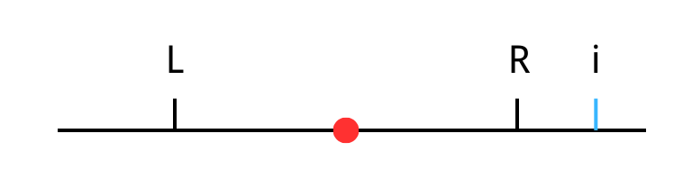
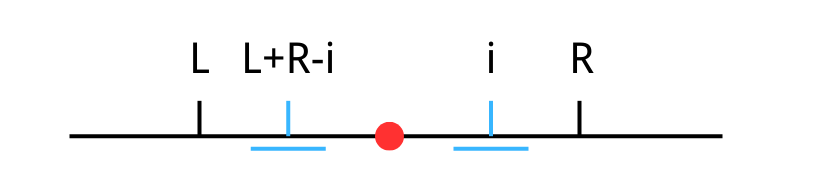
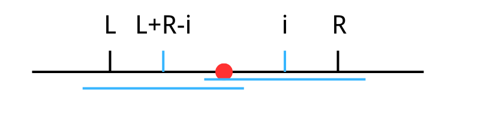

# Manacher(马拉车)算法

## **引入**

若是某个字符串正着表示和反着表示都是一样的，那么我们可以将这个字符串称作回文字符串。例如abba就是一个回文字符串，而字符串abbbc就不是，因为其反着表示的形式为cbbba与原字符串不同。而在一个字符串中可能存在多个满足回文条件的子串，我们一般取长度最长的称做最长回文子串。如在字符串abacdcabad中存在aba，cdc，acdca等满足回文条件的子串，但是并非最长，其最长回文子串为abacdcaba。那么我们如何求一个字符串中的最长回文子串呢？以下以洛谷P3805题为例 

## **例题解析**

## **题目描述**

给出一个只由小写英文字符 a,b,c,…y,z 组成的字符串 S ,求 S 中最长回文串的长度 。字符串长度为 n。  


## **输入格式**

一行小写英文字符 a,b,c,⋯,y,z 组成的字符串 S。 

## **输出格式**

一个整数表示答案。 

## **输入输出样例**

输入：aaa                输出：3

## **说明/提示**

$1 \le n \le 1.1 \times 10^7$

## **思路分析**

## **思路一（Brute Force）：**

由题目意思我们不难想到一个最暴力的做法，我们可以以字符串中的每个字符为中点，比较左右两个字符是否相等，然后逐渐扩大半径，直至求出结果，代码如下。

P3805(bf).cpp 
```cpp
#include <bits/stdc++.h>
using namespace std;
const int MAXN = 5e5 + 5;
void solve()
{
    string s;
    cin >> s;
    int maxn = 0;
    int n = s.length();
    for (int i = 0; i < n; i++)
    {
        int r = 0;
        // 以 i 为中心的奇数长度回文串
        while (i - r >= 0 && i + r < n)
        {
            // 对两侧逐一比较，若是不同则跳出循环，相同则半径+1
            if (s[i - r] != s[i + r])
                break;
            r++;
        }
        // 更新最大回文长度，注意 r 是半径且包含当前的字符，所以长度是 2*r-1
        maxn = max(maxn, 2 * r - 1);
        // 以 i 和 i+1 为中心的偶数长度回文串
        int l = i - 1;
        r = i;
        while (l >= 0 && r < n)
        {
            if (s[l] != s[r])
                break;
            l--;
            r++;
        }
        maxn = max(maxn, r - l - 1);
    }
    cout << maxn << endl;
}
int main()
{
    ios::sync_with_stdio(0);
    cin.tie(0);
    solve();
}
```

显然，虽然这个代码的思路没问题，但是效率太低了，我们需要遍历字符串中的每一个位置的字符，同时要以此展开再遍历，时间复杂度可以到达$O(n^{2})$，这对于题目中这个量级的数据显然会超时，所以我们需要更加巧妙的思路，下面就介绍manacher来优化。

## **思路二（Manacher）：**

Manacher其读音与马拉车相似，故也称马拉车算法。这个算法主要解决的还是回文串相关的问题，目前貌似尚未在其他方面有过使用。  
由于偶数串和奇数串的讨论方法稍有不同（由上个思路也可见出），为了方便之后的算法执行，因而在此算法执行前我们首先要对数组进行一个预处理，在开头加上“%#”，并在每个字符后面都加上“#”。例如：   偶字符串 abba -> %#a#b#b#a#  
奇字符串 aba -> %#a#b#a#  
除去用“%”表示$s[0]$当做哨兵外，无论奇字符串还是偶字符串都变成了奇字符串，方便后面算法执行。 此算法同时维护了一个数组d用于记录回文子串的半径，用$d[i]$表示以i点为中心，在半径为$d[i]$的范围内是一个回文串。注意这里的半径$d[i]$包含了i这个点。  
那么字符串aaba在预处理之后所产生的$d[i]$数组能用下表表示：  

i      1  2  3  4  5  6  7  8  9

s     #  a  #  a  #  b  #  a  #

$d[i]$  1  2  3  2  1  4  1  2  1

在求解的过程中我们可以发现对于字符“#”的$d[i]$其实就是刚才暴力求解时回文子串长度为偶数的情况，而字母位置的$d[i]$便是长度为奇数的情况，此数组d记录了所有情况。同时观察$d[i]$的结果可以发现，这个字符串的最长子串的长度就是最大的$d[i]$-1。那么这个$d[i]$是如何求出来的呢，我们接下来就需要进行$d[i]$的求解。

我们维护一个区间$[l,r]$，在这个区间内的字符串是一个回文字符串，，接下来我们遍历数组，求每个位置的$d[i]$，在遍历时，我们这个i可以分为三种情况。

首先是i在区间外部，如下图：



对于这种情况因为我们无法根据已知情况继续推导，故采用暴力遍历的方法。

其次，i可以在区间内部，由于回文串的对称性，我们可以基于i关于区间中点的对称点l+r-i，的回文半径$d[l+r-i]$，来判断。此种情况分为两种，其一是i+$d[l+r-i]$在维护区间$[l,r]$内，如下图：



对于这种情况，由于未超出维护区间的范围，故对于此i在半径为$d[l+r-i]$的范围内必然是一个回文串，在此基础上我们再进行暴力遍历排查。

另一种情况是i+$d[l+r-i]$的范围超出了维护区间$[l,r]$的范围，如下图：



对于此情况，我们只能保证在维护区间内的情况，故此时i只能保证在半径为r-i+1的情况下有一个回文串，，那么此时$d[i]$先取r-i+1,再进行遍历。

此时，讨论完成三种情况并做完了暴力遍历后我们便获得了i点正确的$d[i]$值，如果i+$d[i]$还在当前区间内我们无需更新，若是超出则需要更新区间使得

l=i-$d[i]$+1

r=i+$d[i]$-1

至此，我们完成了所有$d[i]$，的求解，我们最后需要找出最长的回文子串的长度值便可，此时我们只需遍历一遍$d[i]$，找到最大值并-1便是该字符串中最长回文子串的长度了。

以下是完整代码：

P3805(Manacher).cpp 
```cpp
#include <bits/stdc++.h>
using namespace std;
const int MAXN = 5e5 + 5;
void solve()
{
    string s;
    cin >> s;
    // 预处理字符串
    string str = "%#";
    for (auto ch : s)
    {
        str += ch;
        str += "#";
    }
    int n = str.length();
    vector<int> d(n, 1);
    int l = 0, r = 0;
    for (int i = 1; i < n - 1; i++)
    {
        // 如果 i 在当前回文串的右边界内，则 d[i] 至少等于 d[l + r - i] 和 r - i 中的较小值
        if (i < r)
            d[i] = min(d[l + r - i], r - i);
        // 以 i 为中心，向两侧扩展，比较字符是否相同
        while (str[i - d[i]] == str[i + d[i]])
            d[i]++;
        // 如果以 i 为中心的回文串扩展到了 r 的右边，则更新 l 和 r
        if (i + d[i] > r)
        {
            l = i - d[i] + 1;
            r = i + d[i] - 1;
        }
    }
    // 计算最长回文子串的长度，d[i] 是以 i 为中心的回文串的半径，所以长度是 d[i] - 1
    int maxn = 1;
    for (int i = 0; i < n; i++)
    {
        maxn = max(maxn, d[i] - 1);
    }
    cout << maxn << endl;
}
int main()
{
    ios::sync_with_stdio(0);
    cin.tie(0);
    solve();
}
```

## 练习

除了这题之外还有其他类似的题目，比如求回文子串的个数，或者是求最长回文子串需要将子串输出，这些题目虽然看起来不同，但是其本质都是利用了Manacher算法，在理解掌握例题之后可以尝试自己解决其余类似题目。作者找到几道类似的题目可供练习。

LeetCode 5 最长回文子串

[点此跳转](https://leetcode.cn/problems/longest-palindromic-substring/description/?envType=problem-list-v2&envId=2cktkvj)

LeetCode 647 回文子串   

[点此跳转](https://leetcode.cn/problems/palindromic-substrings/description/?envType=problem-list-v2&envId=2cktkvj)
