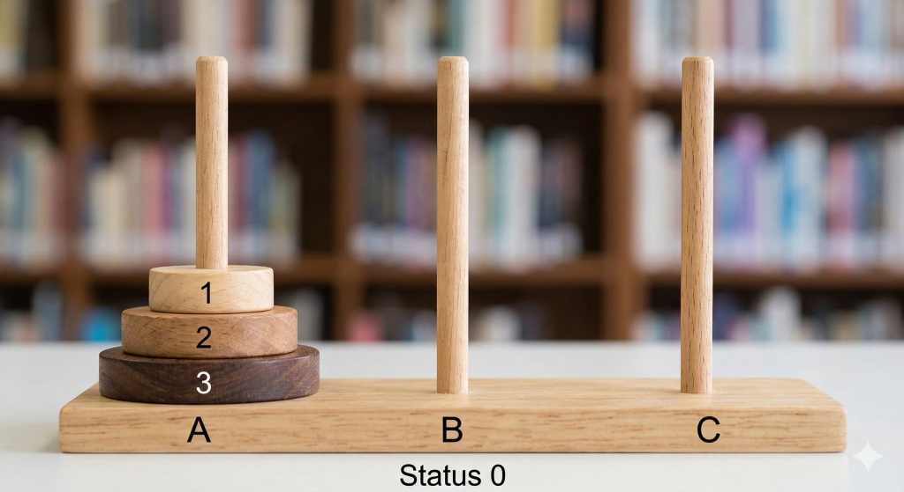
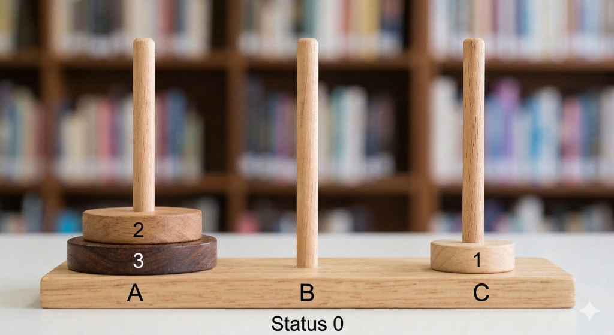
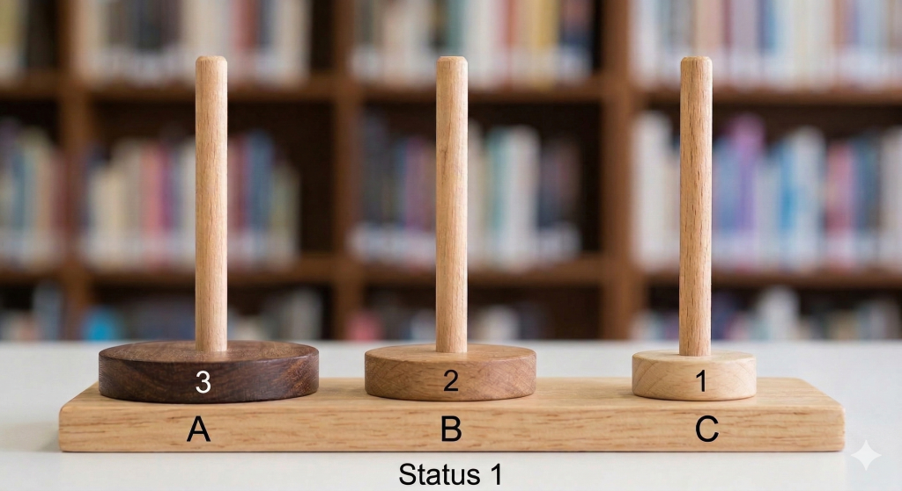
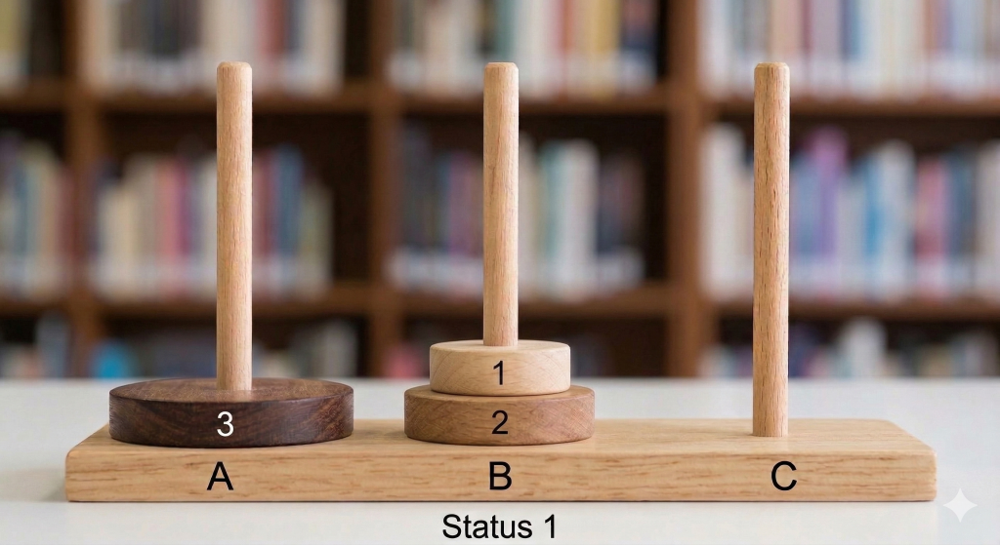
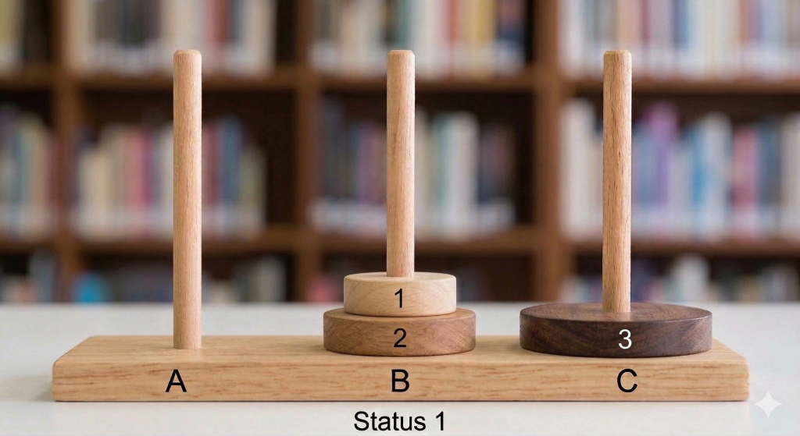
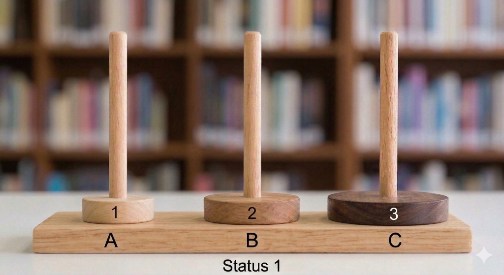
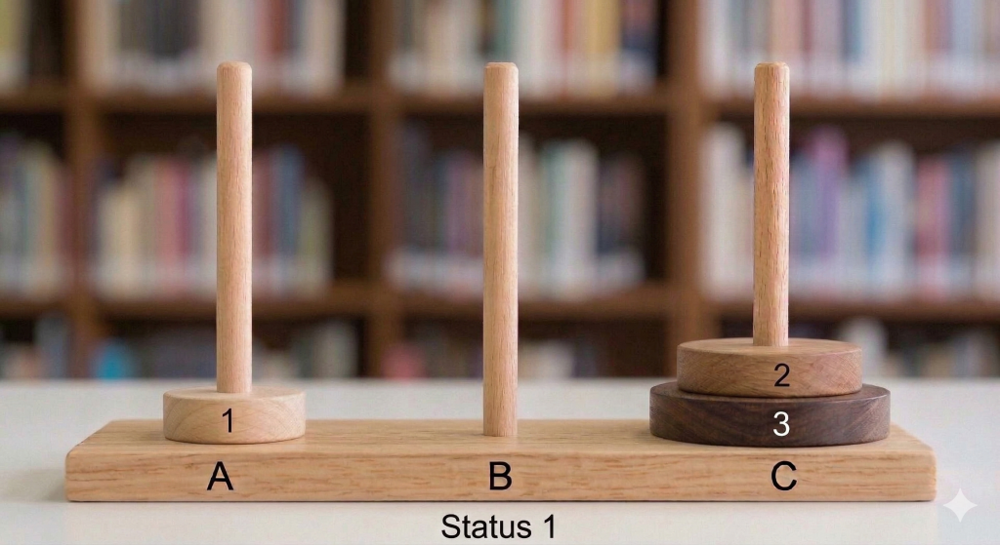
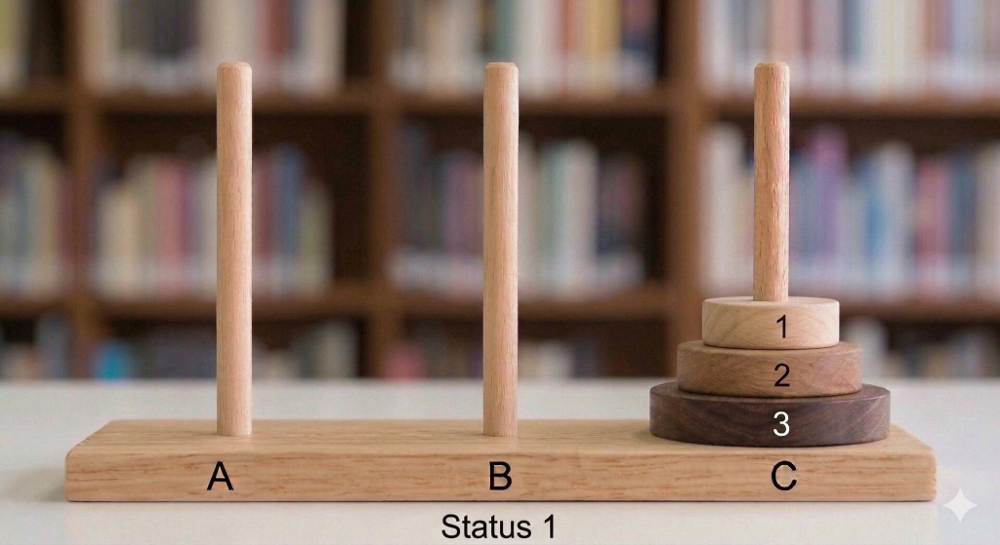

# Hanoi汉诺塔问题

## 引入

汉诺塔是我们已经再熟悉不过的东西了，其游戏的规则是有a，b，c三个杆子，同时在a上有n个盘子，我们需要通过移动将所有盘子都移动至c杆，但移动的过程中每次只能移动一个盘子，且大盘子不能在小盘子上。  
  

## 解析

我们如果需要对这个题编写程序可以采用递归的思想，将这个大问题分解成一步一步的小问题，例如现在所有盘子都在a上，我们可以把最大的盘子上面的n-1个盘子先移动到b这个空盘上，然后将最大的盘子移动到c这个目标杆上，对于剩下的n-1个盘子亦是如此。每次我们先借用辅助盘将最大盘上面的所有盘子移动到辅助盘，然后将最大盘再移动到目标盘，以此分解问题，以此我们可以写出程序的主要函数，如下所示：

```cpp
void hanoi(int n,int a,int b,int c)
{
    if(n==1)
    {
        cout<<"a->c"<<endl;
    }
    else
        hanoi(n-1,a,c,b);
        move(a,b);
        hanoi(n-1,b,a,c);
}
```

对于上述程序我们来分析一下时间复杂度，其中move函数的时间复杂度可以记为常数，几乎不耗时，故该函数时间复杂度主要由两个递归函数hanoi决定，则$T(n)=2 \times T(n-1)+c$，按照规律递推下去可知该函数时间复杂度为$O(2^n)$。

## 拓展

我们发现最终如果要实现汉诺塔这个盘子的移动最终需要$2^n$这么多步，而这正好是我们n个位数的二进制数能表示的所有情况，那么我们想象能不能把两者进行联系呢。显然这是可以的，我们首先将二进制数从小到大排好，例如$0000,0001,0010,\cdots$，然后将这些盘子按照大小从小到大标号，从1开始，并将盘子与二进制的位数关联，标号越小位数越低，例如标号为1的盘子则代表最右边的位数，后我们将二进制数与前一个数比较，若是某位从0变为了1那么就将该位代表的盘子向左移动到最近的可行的柱子，接下来我们将通过三个盘子汉诺塔为例子展示这个思想，如下表：
| 二进制数 | 移动 | 状态 |
| --- | --- | --- |
| 000 | 初始状态 |  |
| 001 | $1: a \rightarrow c$ |  |
| 010 | $2: a \rightarrow b$ |  |
| 011 | $1: c \rightarrow b$ |  |
| 100 | $3: a \rightarrow c$ |  |
| 101 | $1: b \rightarrow a$ |  |
| 110 | $2: b \rightarrow c$ |  |
| 111 | $1: a \rightarrow c$ |  |


此用二进制表示汉诺塔移动方式给我们提供了新的思路，此发现实为巧妙，小编第一次了解时大受震撼。
