# 微信公众平台操作

## 上后台预览

1. 扫码登录（截图给对应负责人帮忙登录）

   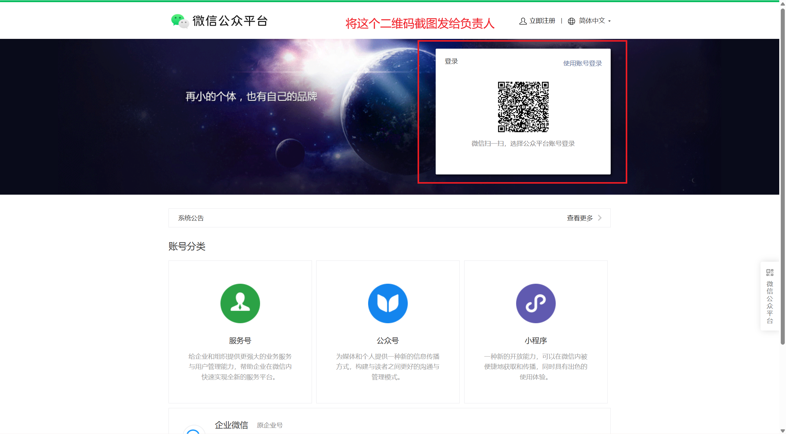

2. 135文章直接复制使用（若最后一行出现多余空行要删除）

   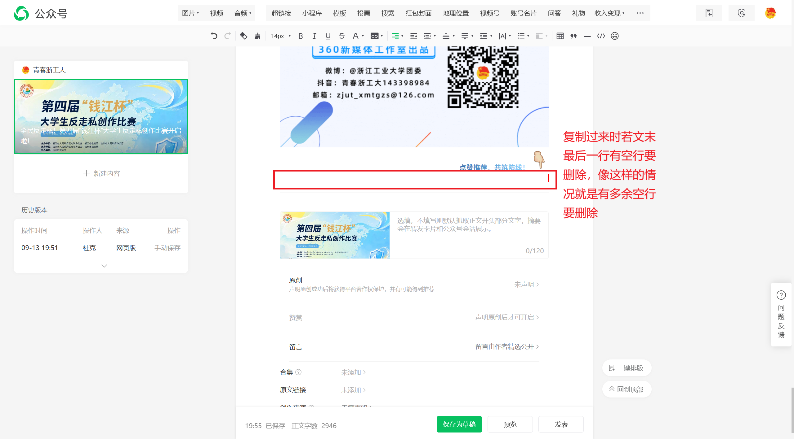

3. 填上标题（==标题栏下面作者不需要写！==）

   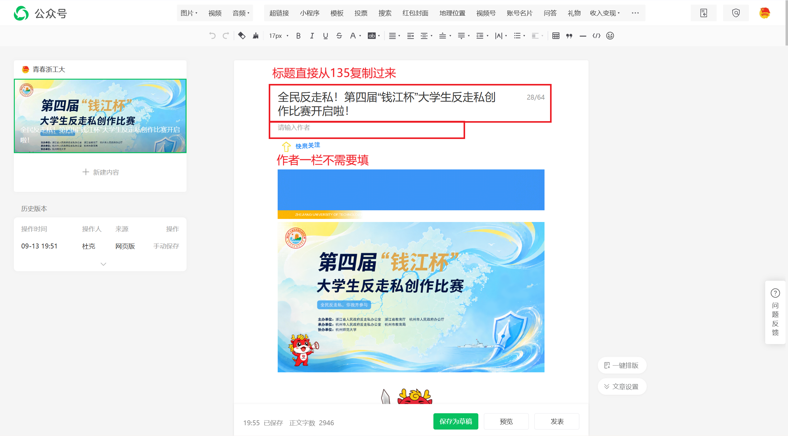

4. ==除头图尾图外所有图片点自适应==

   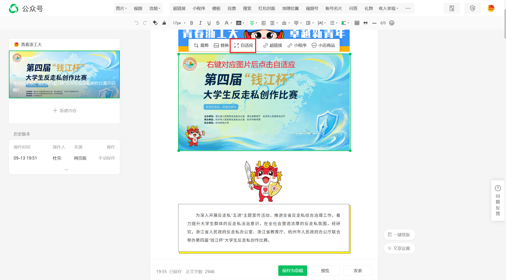

5. 更换文末超链接图片和链接（一般选择最新发布的三个，若没有则可选其他的或者联系负责人让之前的同学尽快制作完成）

   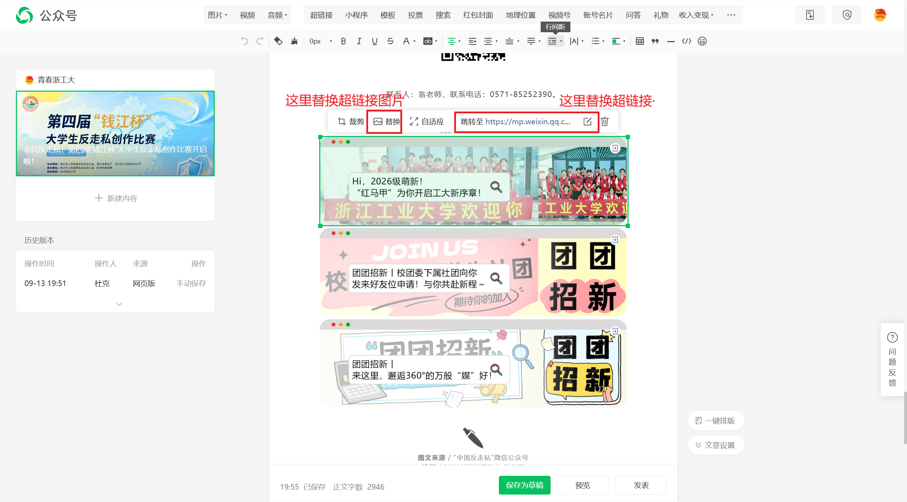

   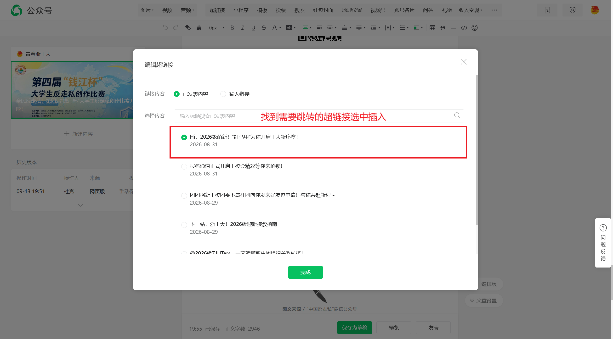

   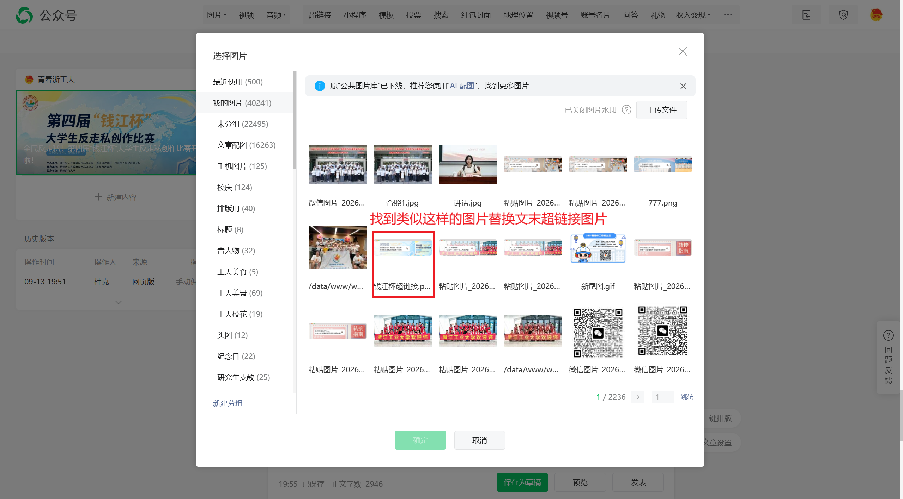

6. 若出现==文章摘要需要删除==

   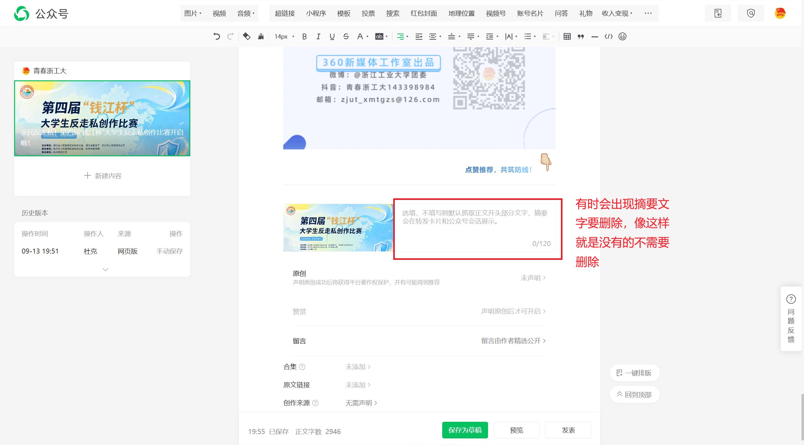

7. 选择大小封面，在摘要左边的图片（==需要截图发给负责人检查==）

   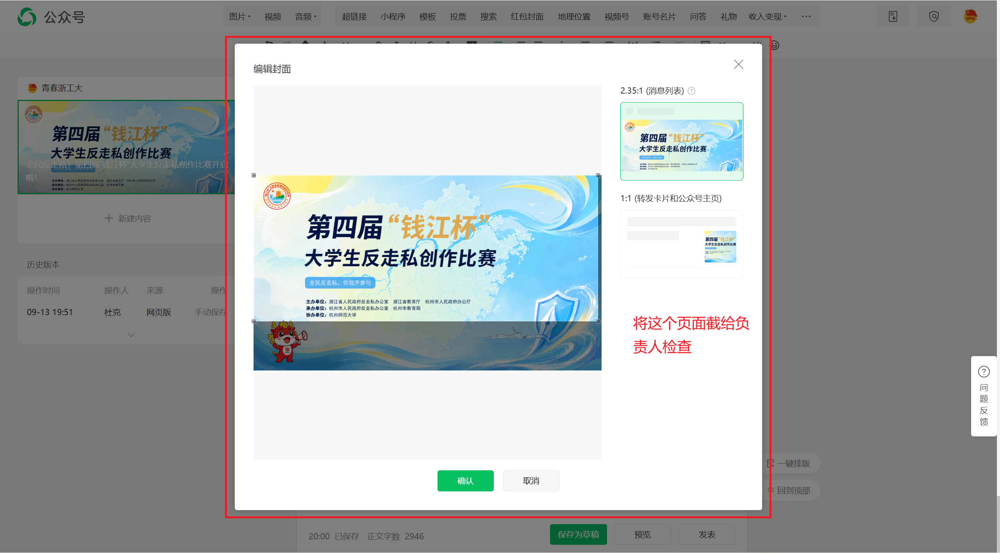

8. 视频号插入，右上角点击视频号后插入相应视频即可

   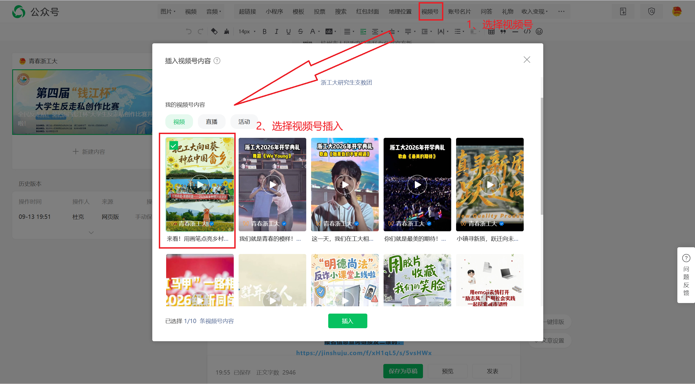

9. 公众号名片插入，右上角点击账号名片后插入即可（有时候在135里制作时已经把公众号名片链接添加过了但是在135里一般不会显示，到后台后会自动显示）

   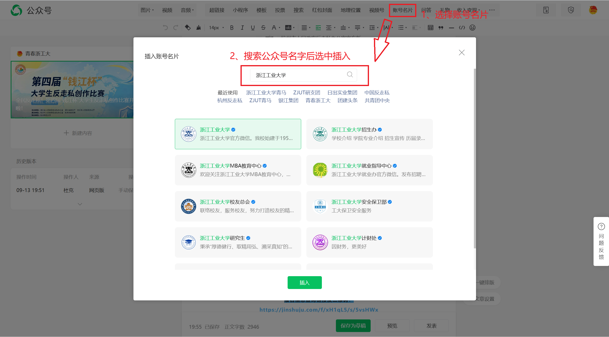

10. 生成预览（发到自己微信，或直接扫码），自己预览完成后转发给负责人检查

## 修改

若仅需要简单的修改则可直接在后台完成，具体如下：

- 字体大小
- 字间距，行间距调整（若需要调整行间距为负数则需要回到135调整）
- 字体颜色
- 换图（参考文末超链接图片，可右键直接替换）

若出现一些复杂修改则需要重新回到135调整再复制使用，具体如下：

- 行间距需要调整为负
- 文字渐变色调整
- 其余一些无法在后台直接操作的格式等问题

## 发布

1. 选择发布（若需要定时发布则需要选中定时发布，并将时间设置为需要的时间）
2. ==群发通知必须要选中！==
3. 将二维码截图发给负责人

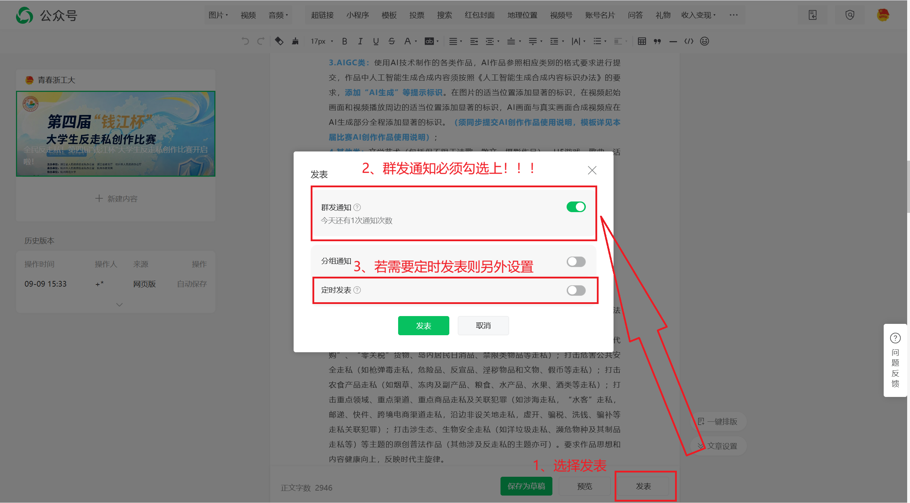

## 文末超链接上传

文末超链接图片制作完成后需要上传到素材库以供之后使用，具体步骤如图

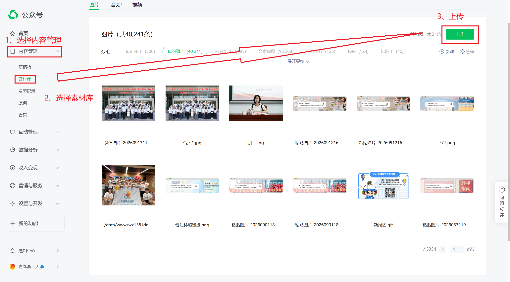

## 其他问题

- 文章草稿会自动保存，不需要手动保存，==若手动另存为其他草稿后记得删除，不要在发布时搞错版本==
- 点击预览后之前生成的预览会自动更新，若嫌麻烦可以不用再转发
