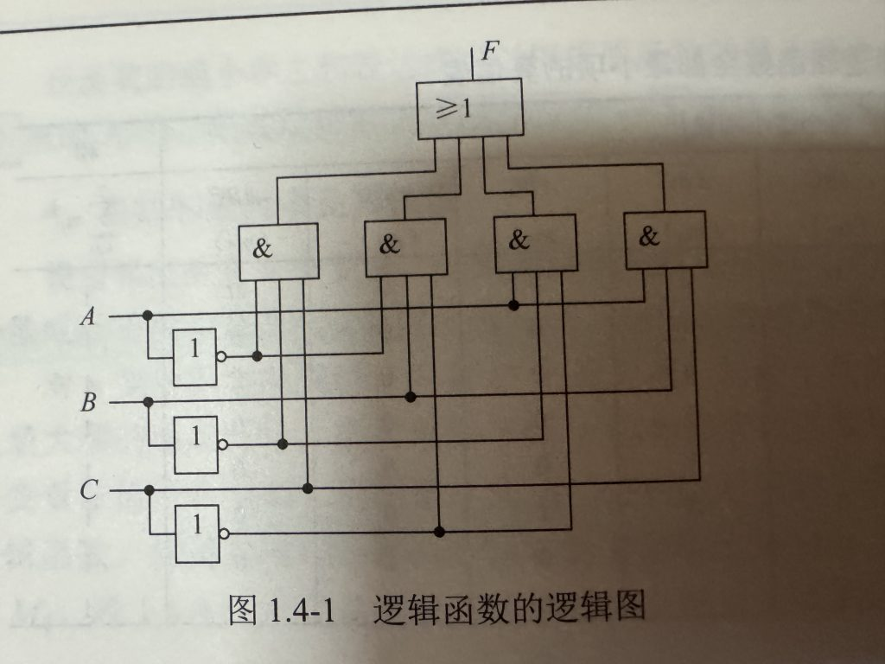
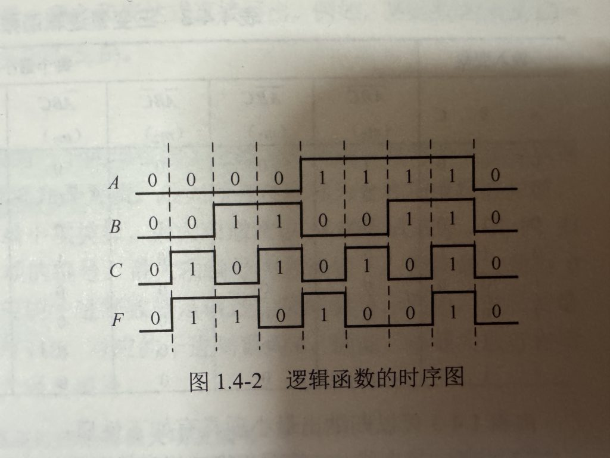
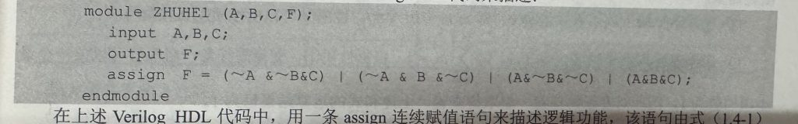

# 数字逻辑基础

## 1.1 绪论

## 1.1.1 模拟信号与数字信号

电子电路在接收或者处理电压或电流信号可分为模拟信号和数字信号两类。  
模拟信号：幅值在上限和下限之间连续，即幅值在上限和下限之间可以取任意实数值的信号。  
                 模拟信号可以是时间连续信号，也可以是时间离散信号。时间离散信号可以看成是对时间连续模拟信号采样得到的，也称作采样信号。  
数字信号：幅值的取值是离散的，即幅值被限制在有限个数值之内的信号。  
                 数字信号可以是时间连续信号，也可以是时间离散信号。数字信号具有保持和突变的特点，即数字信号在一段时间内保持高电平或低电平，而高电平和低电平之间的转化是瞬间的。 

## 1.1.4 数字电路的优点

### 1.数字电路稳定，精度高

模拟电路精度较低，一般只有千分之一，需要数值较精确，例如5.5v和5.8v虽只差0.3v但元件可能工作在不同状态。而如果采用书籍加法器，电压值用二进制数表示，只要增加二进制数的位数就可以提高精度。如32位的数字加法器可以达到$1/2^{32}$的精度。  

### 2.数字电路易于设计和测试

### 3.数字电路可以实现十分复杂的算法

### 4.数字电路处理的数字信号易于保存

### 5.数字电路更易小型化和集成化

 

## 1.2 数制和码制

### 1.十进制

任何一个十进制数都可以用位置计数法及加权和的形式来表示  

$$
\underset{10}{(D)} = \underset{10}{(d_{n-1} d_{n-2} \cdots d_{1} d_{0} \cdot d_{-1} d_{-2} \cdots d_{-m})} = \sum_{i=-m}^{n-1} d_i 10^i
$$

式中n表示整数部分的位数；m表示小数部分的位数；$d_i$ 是十进制数D的数码，表示$0 \sim 9$ 这十个数码中的一个；和式中数字10表示十进制的基数，决定了数码的个数；$10^i$ 表示处于确定位置的数码$d_i$的权重。例如，十进制数123.45可以按照各数码的权重展开为：  

$$
(123.45)_{10} = 1 \times 10^2 + 2 \times 10^1 + 3 \times 10^0 + 3 \times 10^1 + 5 \times 10^{-2}
$$

十进制数有多种表达方式，例如123可以表示为$((123)_{10})$、$((123)_D)$、$123D$等形式，同样的任意进制数也可以用类似的方法表示。 

### 2.二进制

与十进制相似，任意一个二进制数可以采用以下形式表示  

$$
\underset{2}{(B)} = \underset{2}{(b_{n-1} b_{n-2} \cdots b_1 b_0 \cdot b_{-1} b_{-2} \cdots b_{-m})} = \sum_{i=-m}^{n-1} b_i 2^i
$$

通常二进制数最左边数位称为最高位(Most Signification Bit , MSB)，最右边数位称为最低位(Least Signification Bit , LSB)。4位二进制数合在一起称为半字节（Nibble），8位二进制数合在一起称为字节（Byte）。二进制基本运算规则如下：  
加法规则：$0+0=0$，$0+1=1$，$1+0=1$，$1+1=10$  
减法规则：$0-0=0$，$10-1=1$，$1-0=1$，$1-1=0$  
乘法规则：$0 \times 0=0$，$0 \times 1=0$，$1 \times 0=0$，$1 \times 1= 1$  
除法规则：$0 \div 1=0$，$1 \div 1=1$  
二进制数一般用符号B表示，形式与十进制类似。

### 3.十六进制

任意十六进制数可采用以下形式表示：  

$$
\underset{16}{(N)} = \underset{16}{(a_{n-1} a_{n-2} \cdots a_1 a_0 \cdot a_{-1} a_{-2} \cdots a_{-m})} = \sum_{i=-m}^{n-1} a_i 16^i
$$

式中，$a_i$可取$0 \sim 9$以及A、B、C、D、E、F中的任意一个。十六进制一般用“0x”前缀或者“H”后缀表示。 

### 4.进制转换

#### 1.二进制转十进制

二进制数按照位权展开，求和得到十进制，例如$((1101.11)_2)$转换为十进制：  

$$
\underset{2}{(1101.11)} = 1 \times 2^3 +1 \times 2^2 +0 \times 2^1 +1 \times 2^0 +1 \times 2^{-1} + 1 \times 2^{-2} = \underset{10}{(13.75)}
$$

#### 2.十进制转二进制

整数部分做除二取余的运算，并将余数按照倒向排列，即最后的余数出现在最高位。  
小数部分按照乘2取整法，例如将((0.828125)\_{10})转化为二进制数：  
$0.828125 \times 2 \rightarrow 1.656250 \rightarrow 1$  
$0.656250 \times 2 \rightarrow 1.312500 \rightarrow 1$  
$0.312500 \times 2 \rightarrow 0.625000 \rightarrow 0$  
$0.625000 \times 2 \rightarrow 1.250000 \rightarrow 1$  
$0.250000 \times 2 \rightarrow 0.500000 \rightarrow 0$  
$0.500000 \times 2 \rightarrow 1.000000 \rightarrow 1$  
通过乘2取整，直至为0，并将保留的整数自上而下级联，因此  

$$
(0.828125)_{10} = (0.110101)_2
$$

如果结果一直不为0，则取有效位数即可。

#### 3.二进制转十六进制

以小数点为基准，将二进制的整数部分和小数部分每四位对齐，整数部分不足则向高位补0，小数部分不足则向低位补0，然后每组用等值的十六进制码代替，例如：$111011.10101B = 3B.A8H$

### 1.2.2码制

#### 1.BCD码

（Binary-Coded-Decimal，BCD），就是用二进制数表示$0 \sim 9$这十个数码，一般用四位而进制码表示，在16中组合中灵活取10种来完成编码，例如8421码，其中8421表示位权，其表示方式与正常二进制表示十进制数相同，但是只取前十种，后六种为无效码。当十进制数为奇数时8421码最后一位为1，偶数则为0。例如将$(N=(9750)_{10})$转化为8421码，则有：  

$$
N=(\underline{1001}\ \underline{0111}\ \underline{0101}\ \underline{0000})_{8421}
$$

#### 2.格雷码

格雷码中每个相邻的编码只有一位不同，以下是十进制数，二进制码和格雷码的对应关系：
| 十进制数 | 二进制码 | 格雷码 |
| --- | --- | --- |
| 0 | 0000 | 0000 |
| 1 | 0001 | 0001 |
| 2 | 0010 | 0011 |
| 3 | 0011 | 0010 |
| 4 | 0100 | 0110 |
| 5 | 0101 | 0111 |
| 6 | 0110 | 0101 |
| 7 | 0111 | 0100 |
| 8 | 1000 | 1100 |
| 9 | 1001 | 1101 |
| 10 | 1010 | 1111 |
| 11 | 1011 | 1110 |
| 12 | 1100 | 1010 |
| 13 | 1101 | 1011 |
| 14 | 1110 | 1001 |
| 15 | 1111 | 1000 |

二进制码与格雷码的转换：  
在二进制码中相邻两位相等则格雷码为0，不等则为1，最高位与0比较。例如：  

$$
(0111)_B=0100
$$

格雷码由于其相邻两数之间只差一位，做变化时误差较小经常被使用，而正常BCD码两数之间可能存在多位不一样，在做变化时由于每位变化时间不同可能存在中间态。例如若要将三挡速度变为四挡，正常编码形式是$0011 \rightarrow 0100$，但是由于变化不及时可能存在$0111$的状态，而采用格雷码的形式则是$0010 \rightarrow 0110$。可以发现只变化了一位，故误差较小。

## 1.3逻辑代数基础

### 1.3.1基本逻辑运算

#### 1.与运算

只用当事件A和B同时发生时才为真，可以用以下表达式描述：$[F=A \cdot B=AB]$

#### 2.或运算

事件A和事件B只要满足一个就位真，可以用以下表达式描述：$[F=A+B]$

#### 3.非运算

用来求反，可用一下表达式描述：
$$
F=\overline{A}
$$

### 1.3.2复合逻辑运算

与非运算：由与运算和非运算结合，可以写作：
$$
F=\overline{AB}
$$

或非运算：由或运算和非运算组合，可以写作：
$$
F=\overline{A+B}
$$

异或运算：当两个A,B输入相同时输出0，否则输出1，可以表示为：
$$
F=A \overline{B}+ \overline{A} B=A \oplus B
$$

同或运算：与异或运算相反，当两个A,B输入相同时输出1，否则输出0，可以表示为：
$$
F= \overline{A} \overline{B} + AB=A \odot B= \overline{A \oplus B}
$$

### 1.3.3基本公式

以下是一些逻辑代数中经常运用到的基本公式：

| 公理 | $0 \cdot 0=0$ $0 \cdot 1=1 \cdot 0=0$ $1 \cdot 1=1$ | $0+0=0$ $0+1=1+0=1$ $1+1=1$ |
| --- | --- | --- |
| 0-1律 | $\overline{0} =1$ $0+A=A$ $1+A=1$ | $\overline{1} =0$ $1 \cdot A=A$ $0 \cdot A=0$ |
| 互补律 | $A+ \overline{A} =1$ | $A \cdot \overline{A}=0$ |
| 还原律 | $\overline{ \overline{A}} =A$ |   |
| 重叠律 | $A+A+A+ \cdots =A$ | $A \cdot A \cdot A \cdot \cdots =A$ |
| 交换律 | $A+B=B+A$ | $A \cdot B= B \cdot A$ |
| 结合律 | $A+(B+C)=(A+B)+C$ | $A \cdot (B \cdot C)=(A \cdot B) \cdot C$ |
| 分配律 | $A \cdot ( B +C)=A \cdot B+A \cdot C$ | $A+B \cdot C=(A +B) \cdot (A+C)$ |
| 吸收律 | $A+A \cdot B =A$ | $A \cdot (A+B)=A$ |
| 合并律 | $AB+A \overline{B}=A$ | $(A+B)(A+\overline{B})=A$ |
| 反演律（摩根定理） | $\overline{A+B}= \overline{A} \cdot \overline{B}$ | $\overline{A \cdot B}= \overline{A} + \overline{B}$ |

在逻辑代数运算中会遇到一些公式，以下我们推导证明几个常用的公式。

常用公式一：$A+ \overline{A} B=A+B$

方法一（从右至左）：$A+B=(A+B)(A+\overline{A})=AA+A\overline{A}+AB+B\overline{A}=A(1+B)+\overline{A}B=A+\overline{A}B$

方法二（从左至右）：$A+\overline{A}B=A(B+\overline{B})+\overline{A}B=AB+A\overline{B}+\overline{A}B=AB+AB+A\overline{B}+\overline{A}B=A(B+\overline{B})+B(A+\overline{A})$

方法三（从左至右）：$A+\overline{A}B=A(1+B)+\overline{A}B=A+AB+\overline{A}B=A+B(A+\overline{A})=A+B$

该公式可以简单总结为，如果两项相加但是某一项含有另一项的非，则这个非因子多余。

常用公式二：$AB+ \overline{A} C +BC=AB+ \overline{A} C$

方法一（从右至左）：$AB+\overline{A}C=(AB+\overline{A})(AB+C)=(B+\overline{A})(AB+C)=AB+\overline{A}C+BC$

方法二（从左至右）：$AB+\overline{A}C+BC=AB+\overline{A}C+BC(A+\overline{A})=AB+ABC+\overline{A}C+\overline{A}BC=AB+\overline{A}C$

该公式可以简单表示为，如果第一项含有原变量，第二项含有该变量的反变量，只要第三项的因子含有前两项除了该变量的其他变量，那么第三项作废，可以进一步推广为以下公式：
$$
AB+ \overline{A} C+BCD \cdots=AB+ \overline{A} C
$$

### 1.3.4基本规则

#### 1.代入规则

在含有变量的某个等式中若将某个变量A全部用同一个逻辑表达式代替，则等式依然成立，反之，同一个逻辑表达式全部用同一个变量代替则也成立。由此，摩根定律可以演化成n个变量：
$$
\overline{A_1+A_2+ \cdots + A_n}= \overline{A_1} \overline{A_2} \cdots \overline{A_n} , \overline{A_1A_2 \cdots A_n}= \overline{A_1}+ \overline{A_2} + \cdots + \overline{A_n}
$$

#### 2.反演规则

对任何一个逻辑表达式，如果将其中的“+”换成“$\cdot$”，“$\cdot$”变为“+”，1变为0,0变为1，“原变量”变为“反变量”。同时有以下几点需要注意：

1、保持原函数的运算次序，先与后或，必要时加入括号。

2、对于大非号的处理可以直接去掉或者将大非号保留，下面的变量做反演规则变换。

3、若存在异或或同或运算，则“$\oplus$”变为“$\odot$”，“$\odot$”变为“$\oplus$”。

以下是一个反演规则变化的例子：

已知 $Y=A\overline{B}+\overline{(A+C)B}+\overline{A}\overline{B}\overline{C}$，求 $\overline{Y}$。

解：
$$
\overline{Y}=(\overline{A}+B)\cdot\overline{\overline{A}\overline{C}+\overline{B}}\cdot(A+B+C)=(\overline{A}+B)\cdot((A+C)\cdot B)\cdot(A+B+C)
$$

#### 3.对偶规则

如果两个逻辑表达式相等则他们的对偶式也相等，具体对偶式的变化按照以下规则：对于任意的表达式，将“+”变为“$\cdot$”，将“$\cdot$”变为“+”，1变为0,0变为1，并保持原来的运算次序不变。无需将变量取反！！！有以下例子：

已证明 $A+\overline{A}B=A+B$，那么 $A(\overline{A}+B)=AB$ 也成立。

已证明 $AB+\overline{A}C+BC=AB+\overline{A}C$，那么 $(A+B)(\overline{A}+C)(B+C)=(A+B)(\overline{A}+C)$ 也成立。

#### 4.展开规则

设逻辑函数 $Y=F(A_1,A_2,\cdots,A_i,\cdots,A_n)$，则有：
$$
F(A_1,A_2,\cdots,A_i,\cdots,A_n)=A_iF(A_1,A_2,\cdots,1,\cdots,A_n)+\overline{A_i}F(A_1,A_2,\cdots,0,\cdots,A_n)
$$

$$
F(A_1,A_2,\cdots,A_i,\cdots,A_n)=[A_i+F(A_1,A_2,\cdots,0,\cdots,A_n)]\cdot[\overline{A_i}+F(A_1,A_2,\cdots,1,\cdots,A_n)]
$$

利用展开规则可以将具有较多变量的函数分解成为几个具有较少变量的函数。

## 1.4逻辑函数及其表示方法

## 1.4.1逻辑函数的基本表示方法

我们一般用0或1表示逻辑变量，且逻辑变量有且仅有两种状态中的一种。以电灯开关状态为例，先有一个房间有三扇门，每一扇门上都有一个控制房间内电灯的开关，且任意开关都能打开或者关闭房间内的电灯用A=1表示开关闭合，用A=0表示开关断开。我们可以用多种方法表示，例如真值表，逻辑函数表达式，逻辑图，时序图和硬件语言等。以下将一一介绍。

### 1.真值表

简而言之，真值表便是把逻辑变量的每一种情况都考虑，最后绘制成表，例如下表：

| A | B | C | F |
| --- | --- | --- | --- |
| 0 | 0 | 0 | 0 |
| 0 | 0 | 1 | 1 |
| 0 | 1 | 0 | 1 |
| 0 | 1 | 1 | 0 |
| 1 | 0 | 0 | 1 |
| 1 | 0 | 1 | 0 |
| 1 | 1 | 0 | 0 |
| 1 | 1 | 1 | 1 |

### 2.逻辑函数表达式

用有限个与、或、非等逻辑运算符号将若干个逻辑变量链接起来的表达式称为逻辑函数表达式。逻辑函数表达式一般分为与或式和或与式。

与或式：将真值表中的真值为1的组合找出，变量为1的写成原变量，变量为0的写成反变量，进行逻辑相乘，最后将这些组合进行逻辑相加。以上图真值表为例，写出的逻辑函数表达式为以下：
$$
F= \overline{A} \overline{B} C+ \overline{A} B \overline{C} +A \overline{B} \overline{C} +ABC
$$

或与式：将真值表中真值为0的组合找出，真值为0的写作原变量，真值为1的写作反变量，进行逻辑相加，最后将各个组合进行逻辑相乘。同样以上个真值表为例，可以写出一以下逻辑函数表达式：
$$
F=(A+B+C)(A+\overline{B}+\overline{C})(\overline{A}+B+\overline{C})(\overline{A}+\overline{B}+C)
$$

一般如果没有特殊说明默认使用与或式。

### 3.逻辑图

不作过多解释，该例子逻辑图如下：

### 4.时序图

从000到111依次画出各种情况，用低电平表示0，高电平表示1。

### 5.硬件描述语言

可以用VHDL和Verilog描述，以下是VHDL的描述：

## 1.4.2逻辑函数的标准形式

### 1.函数的最小项及其性质

如果与项P中包含了所有n个逻辑变量，且每个变量都以原变量或者反变量出现一次，则称P为逻辑函数的一个最小项。例如当$n=3$时，共有$\overline{A} \overline{B} \overline{C} , \cdots , ABC$八个最小项。为方便表示，每个最小项用$m_i$记录，其中i为项号，将原变量记作1，反变量记作0，其二进制数所对应的十进制数即为i，例如$ABC=m_7$。

性质：

（1）对于任意一个最小项，有且仅有一组变量取值使得该最小项的值为1，且该取值与最小项形式相同，例如只有当$ABC=101$时，$m_5= A \overline{B} C =1$。

（2）任意两个最小项的乘积恒为0，即$m_i m_j=0 \quad i \neq j$。

（3）全部最小项的逻辑和恒等于1，即$\sum_{i=0}^{2^n-1}=1$

### 2.逻辑函数的标准与或式

如果逻辑函数表达式中所有的乘积项均为最小项则称该表达式为逻辑函数的标准与或式。
$$
F(A,B,C)=\overline{A} \overline{B} C +\overline{A} BC+ A \overline{B} C + AB \overline{C} +ABC=m_1+m_3+m_5+m_6+m_7= \sum m(1,3,5,6,7)
$$
 转换方法：

如果有公共大非号，先利用摩根定律去掉非号。

利用$A+ \overline{A} =1$补足缺少的变量。

### 3.反函数的标准与或式

我们知道某个函数与反函数之间有以下关系，即$F+ \overline{F}=1$，而又有全部最小项之和为1，故可以推出有：
$$
F+\overline{F} =\sum_{i=0}^{2^n-1} m_i
$$
 据此公式，我们若已知一个逻辑函数的与或式为$F= \sum_{i} m_i$ 那么可以知道它的反函数的标准与或式为 
$$
\overline{F} = \sum_{k \neq i} m_k
$$

### 4.函数的最大项及其性质

如果或项P中包含了n个变量，且每个变量都以原变量或者反变量的形式出现一次，则称P为逻辑函数的一个最大项。与最小项相反，我们将反变量记作1，原变量记作0，其二进制数所对应的十进制数即为项号i，用$M_i$记录。

性质：

（1）与最小项相似，对任意最大项，有且仅有一组变量取值使得该最大项的值为0，且该取值形式与该最大项形式相反，例如只有当$ABC=010$时，才有最大项($A+ \overline{B} +C$)的取值为0。

（2）任意两个最大项的和恒为1，即$M_i+M_j=1 \quad i \neq j$

（3）全部最大项的乘积恒等于0，即$\prod_{i=0}^{2^n-1} M_i=0$

（4）编号相同的最小项和最大项是互反的，即$M_i= \overline{m_i}$。例如：
$$
M_2=A+ \overline{B} +C =\overline{ \overline{A+ \overline{B} +C}} = \overline{ \overline{A} B \overline{C}} =\overline{m_2}
$$

### 5.逻辑函数的标准或与表达式

任何一个逻辑函数都可以化成唯一的最大项之积的形式，称为标准或与式。

### 6.与或式与或与式的互相转化

根据摩根定律和最大项的性质4，可以得以下公式：
$$
F=\overline{ \sum_{k \neq  i} m_k} = \prod_{k \neq i} \overline{m_k} = \prod_{k \neq i} M_k
$$
