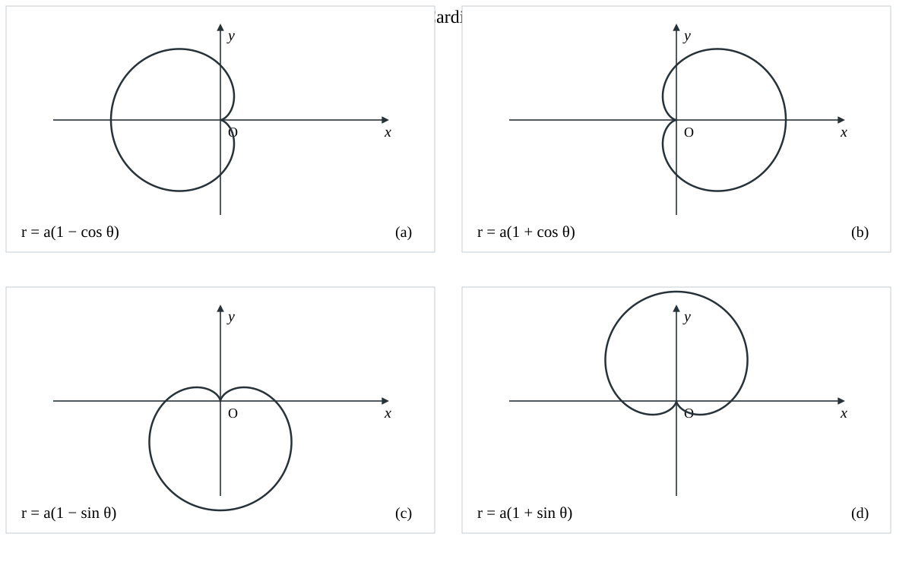
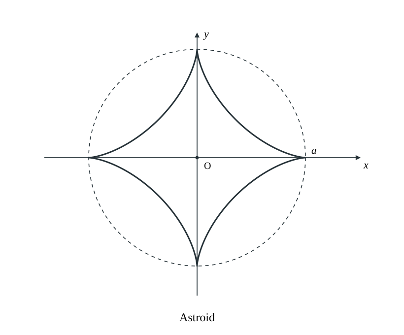
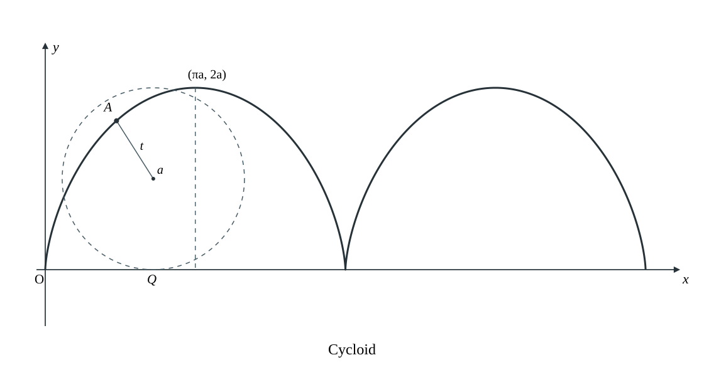

#  数学公式速记

## 常用等价无穷小$(x \to 0)$

1. $\sin x \sim x$
2. $\tan x \sim x$
3. $\arcsin x \sim x$
4. $\arctan x \sim x$
5. $\ln(1+x) \sim x$
6. $e^x-1 \sim x$
7. $a^x-1 \sim x \ln a$
8. $1- \cos x \sim \frac{1}{2} x^2$
9. $(1+x)^a -1 \sim ax$
10. $\ln(x+ \sqrt{1+x^2}) \sim x$
11. $1- (\cos x)^a \sim \frac{1}{2} a x^2 , a \neq 0$ 
12. $x-\sin x \sim \frac{x^3}{6}$
13. $\arcsin x - x \sim \frac{x^3}{6}$
14. $\tan x - x \sim \frac{x^3}{3}$
15. $x - \arctan x \sim \frac{x^3}{3}$
16. $\ln(1+x)-x \sim -\frac{1}{2} x^2$
17. $(1+x)^{\frac{1}{x}} -e \sim - \frac{e}{2}x (x \to 0^+)$

## 常用结论1

$当 x \to +\infty 时，有 \ln ^\alpha x \ll x^ \beta \ll a^x，其中 \alpha ，\beta > 0，a>1$

$当 n \to \infty ，有\ln ^\alpha \ll n^\beta \ll a^n \ll n! \ll n^n，其中 \alpha ，\beta >0， a>1$

## 泰勒展开

$$
f(x)=\sum_{n=0}^{\infty} \frac{f^{(n)}(0)}{n!} x^n=f(0) + f'(0)x + \frac{f''(0)}{2!}x^2 + \cdots + \frac{f^{(n)}(0)}{n!} x^n + o(x^n)
$$

1. $\displaystyle \sin x = \sum_{n=0}^{\infty} (-1)^n \frac{x^{2n+1}}{(2n+1)!} = x - \frac{x^3}{3!} + o(x^3)$
2. $\displaystyle \cos x = \sum_{n=0}^{\infty} (-1)^n \frac{x^{2n}}{(2n)!} = 1 - \frac{x^2}{2!} + \frac{x^4}{4!} +o(x^4)$
3. $\arcsin x = x + \frac{x^3}{3!} + o(x^3)$
4. $\tan x = x + \frac{x^3}{3} + o(x^3)$
5. $\arctan x = x - \frac{x^3}{3} + o(x^3)$
6. $\displaystyle \ln(1+x) =\sum_{n=1}^{\infty} (-1)^{n-1} \frac{x^n}{n} = x - \frac{x^2}{2} + \frac{x^3}{3} + o(x^3)$
7. $\displaystyle e^x =\sum_{n=0}^{\infty} \frac{x^n}{n!}= 1+x+\frac{x^2}{2!} + \frac{x^3}{3!} + o(x^3)$
8. $(1+x)^\alpha = 1+ \alpha x +\frac{\alpha (\alpha -1) x^2}{2!} +o(x^2)$
9. $\displaystyle \frac{1}{1+x} = \sum_{n=0}^{\infty} (-1)^n x^n = 1-x+x^2 - x^3 +\cdots +(-1)^n x^n , -1<x<1$
10. $\displaystyle \frac{1}{1-x} = \sum_{n=0}^{\infty} x^n = 1+ x + x^2 + x^3 + \cdots + x^n, -1<x<1$

## 常见数列前$n$项的和

1. $\displaystyle \sum_{k=1}^n k = 1+2+3+ \cdots +n = \frac{n(n+1)}{2}$
2. $\displaystyle \sum_{k=1}^{n} k^2 = 1^2+ 2^2 +3^2 + \cdots + n^2 = \frac{n(n+1)(2n+1)}{6}$
3. $\displaystyle \sum_{k=1}^{n} \frac{1}{k(k+1)} = \frac{1}{1\times2}+\frac{1}{2\times3}+ \cdots + \frac{1}{n\times(n+1)} = \frac{n}{n+1} \qquad \lim_{n\to \infty} \sum_{k=1}^{n} \frac{1}{k(k+1)} = \lim_{n \to \infty} \frac{n}{n+1} =1$

## 海涅定理（归结原则）

有时在求数列极限时直接不方便求，那么可以想到洛必达法则、泰勒展开等，但是这些公式只存在于函数当中，由于数列是离散的故无法求。此时我们可以将数列理解为下标为整数的函数，将数列极限与函数极限联系起来，这便是海涅定理。以下是定义解释：

设$f(x)$在$\overset{\circ}{U}(x_0,\delta)$内有定义，则$\displaystyle \lim_{x \to x_0} f(x) = A$存在$\Leftrightarrow$对任何$\overset{\circ}{U}(x_0,\delta)$内以$x_0$为极限的数列${x_0}(x_n \neq x_0)$，极限$\displaystyle \lim_{n \to \infty} f(x_n) = A$

以下有一些常用实例：

1. 当$x \to 0$时，取$x_n = \frac{1}{n}$，即若$\displaystyle \lim_{x \to 0} f(x) =A$，则$\displaystyle \lim_{n \to \infty} f \left(\frac{1}{n} \right) =A$
2. 当$x \to +\infty$时，取$x_n = n$，即若$\displaystyle \lim_{x \to +\infty} f(x) =A$，则$\displaystyle \lim_{n \to \infty} f (n) =A$
3. 当$x_n \to a$时，取$x_n \neq a$，即若$\displaystyle \lim_{x \to a} f(x) =A$，则$\displaystyle \lim_{n \to \infty} f(x_n) =A$

## 常用结论2

若有一个函数$f(x,y)= \begin{cases} xy, & xy \neq 0 \cr x, & y=0 \cr y, & x=0 \end{cases}$，那么其函数值一定小于等于各分段表达式绝对值相加，即$f(x,y) \leq |xy| +|x| +|y|$

## 重要不等式

1. 设$a,b$均为实数，那么有$a. |a \pm b| \leq ||a| + |b|| \quad b.|a-b| \geq ||a|-|b||$。

   以上不等式$a.$也可以推广为$n$个实数的情形，即
   $$
   |a_1 \pm a_2 \pm a_3 \pm \cdots \pm a_n| \leq |a_1| + |a_2| + |a_3| + \cdots + |a_n|
   $$

2. $a. \sqrt{ab} \leq \frac{a+b}{2} \leq \sqrt{ \frac{a^2 + b^2}{2}} \quad (a,b \geq 0).$

   $b. |ab| \leq \frac{a^2 + b^2}{2}$

   $c. \sqrt[3]{abc} \leq \frac{a+b+c}{3} \leq \sqrt{ \frac{a^2 + b^2 + c^2}{3}}\quad(a,b,c \geq 0)$

3. 设$a \geq b \geq 0$，则$\begin{cases} a^m \geq b^m, & m>0 \cr a^m \leq b^m, & m<0 \end{cases}$

4. 若$0<a<x<b,0<c<y<d$，则$\frac{c}{b} < \frac{y}{x} <\frac{d}{a}.$

5. $\sin x<x<\tan x \left(0<x< \frac{\pi}{2}\right).$

6. $\sin x < x \quad (x>0).$

7. 当$0<x<\frac{\pi}{4}$时，$x<\tan x<\frac{4}{\pi} x.$

8. 当$0<x<\frac{\pi}{2}$时，$\sin x > \frac{2}{\pi} x.$

9. $\arctan x \leq x \leq \arcsin x(0 \leq x \leq 1).$

10. $e^x \geq x+1$

11. $x-1 \geq \ln x \quad(x > 0)$

12. $\frac{1}{1+x} < \ln \left(1+ \frac{1}{x} \right) < \frac{1}{x}(x>0)$

    $\frac{x}{1+x} < \ln \left(1+ x \right) < x(x>0)$

## 压缩映射原理

### 原理一

对数列$\{x_n\}$，若存在常数$k(0<k<1)$，使得$|x_{n+1} -a| \leq k|x_n-a|,n=1,2, \cdots ,$则$\{x_n\}$收敛于$a$.

### 原理二

对数列$\{x_n\}$，若$x_{n+1}=f(x_n),n=1,2,\cdots, f(x)$可导，$a$是$f(x)=x$的唯一解，且对任意$x\in \mathbb{R}$，有$|f'(x)|\leq k<1$，则$\{x_n\}$收敛于$a.$

##  常用结论3（绝对值与可导性的关系）

若$f(x)$在$x=a$处连续，同时$F(x)=f(x)|x-a|$，则$f(a)=0$，是$F(x)$在$x=a$处可导的充分必要条件。

## 常用结论4（绝对值的可导性）

1. 若$\begin{cases} f(x)\text{ 在 }x_0\text{ 处可导} \cr f(x_0)=0 \cr f^{\prime}(x_0) \neq 0\ (\text{可测变化率}) \end{cases}$，则$|f(x)|$在$x_0$处不可导。
2. 若$\begin{cases} f(x)\text{ 在 }x_0\text{ 处可导} \cr f(x_0) \neq 0 \end{cases}$，则$|f(x)|$在$x_0$处可导。

## 反函数的导数

### 反函数的一阶导数

设$y=f(x)$为单调、可导的函数，且$f'(x) \neq 0$，则存在反函数$x= \varphi (y)$，且$\frac{dx}{dy}=\frac{1}{\frac{dy}{dx}}$，即$\varphi'(y)=\frac{1}{f'(x)}$.

### 反函数的二阶导数

在$y=f(x)$单调，且二阶可导的情况下，若$f'(x) \neq 0$，则存在反函数$x= \varphi (y)$，记$f'(x)=y'_x$，$\varphi'(y)=x'_y$，则有

- $y''_ {xx}=-\frac{x''_ {yy}}{(x'_ y)^3}$
- $x''_ {yy}=-\frac{y''_ {xx}}{(y'_ x)^3}$

## 极值点的判断

### 必要条件

设$f(x)$在$x=x_0$处可导，且在点$x_0$处取得极值，则必有$f'(x_0)=0$.

### 第一充分条件

设$f(x)$在$x=x_0$处连续，且在$x_0$的某去心邻域$\overset{\circ}{U}(x_0,\delta)(\delta>0)$内可导.

1. 若$x \in (x_0 - \delta, x_0)$时，$f'(x)<0$，而$x \in (x_0,x_0 + \delta)$时，$f'(x)>0$，则$f(x)$在$x=x_0$处取得极小值.
2. 若$x \in (x_0 - \delta, x_0)$时，$f'(x)>0$，而$x \in (x_0,x_0 + \delta)$时，$f'(x)<0$，则$f(x)$在$x=x_0$处取得极大值.
3. 若$f'(x)$在$(x_0 - \delta, x_0)$和$(x_0, x_0 + \delta)$内不变号，则点$x_0$不是极值点.

### 第二充分条件

设$f(x)$在$x=x_0$处二阶可导，且$f'(x_0)=0，f''(x_0) \neq 0$.

1. 若$f''(x_0)<0$，则$f(x)$在$x_0$处取得极大值.
2. 若$f''(x_0)>0$，则$f(x)$在$x_0$处取得极小值.

### 第三充分条件

设$f(x)$在$x=x_0$处$n$阶可导，且$f^{(m)}(x_0)=0(m=1,2, \cdots , n-1)，f^{(n)}(x_0) \neq 0 (n \geq 2)$，则

1. 当$n$为偶数且$f^{(n)}(x_0)<0$时，$f(x)$在$x_0$处取得极大值.
2. 当$n$为偶数且$f^{(n)}(x_0)>0$时，$f(x)$在$x_0$处取得极小值.

## 拐点的判断

### 必要条件

设$f''(x_0)$存在，且点$(x_0,f(x_0))$为曲线的拐点，则$f''(x_0)=0$.

### 第一充分条件

设$f(x)$在点$x=x_0$处连续，在点$x=x_0$的某去心邻域$\overset{\circ}{U}(x_0,\delta)$内二阶导数存在，且在该点的左、右邻域内$f''(x)$变号，则点$(x_0,f(x_0))$为曲线的__拐点__.

### 第二充分条件

设$f(x)$在$x=x_0$处三阶可导，且$f''(x_0)=0，f'''(x_0) \neq 0$，则点$(x_0,f(x_0))$为曲线的拐点.

### 第三充分条件

设$f(x)$在$x_0$处$n$阶可导，且$f^{(m)}(x_0)=0(m=2,\cdots,n-1), f^{(n)}(x_0) \neq 0(n \geq 3)$，则当$n$为奇数时，点$(x_0,f(x_0))$为曲线的拐点.

## 极值点和拐点的重要结论

1. 曲线的可导点不可同时为极值点和拐点；曲线的不可导点可同时为极值点和拐点.

2. 设多项式函数$f(x)=(x-a)^n g(x)(n>1)$，且$g(a) \neq 0$，则当$n$为偶数时，$x=a$是$f(x)$的极值点；当$n$为奇数时，点$(a,0)$是曲线$f(x)$的拐点.

3. 设多项式函数$f(x)=(x-a_1)^{n_1} (x-a_2)^{n_2} \cdots (x-a_k)^{n_k}$，其中$n_i$是正整数，$a_i$是实数且$a_i$两两不等，$i=1,2, \cdots ,k$.

   记$k_1$为$n_i=1$的个数，$k_2$为$n_i>1$且$n_i$为偶数的个数，$k_3$为$n_i>1$且$n_i$为奇数的个数，则$f(x)$的极值点个数为$k_1+2k_2+k_3-1$，拐点的个数为$k_1+2k_2+3k_3-2$.

## 函数对称性判断

1. 若$F(x,y)=F(2T-x,y)$或$F(T+x,y)=F(T-x,y)$，则$y=f(x)$关于$x=T$对称.
2. 若$F(x,y)=F(x,2T-y)$或$F(x,T+y)=F(x,T-y)$，则$y=f(x)$关于$y=T$对称.
3. 若$F(a+x,y)=F(a-x,-y)$，则$y=T$关于$(a,0)$点dui'ch

## 常见平面曲线

### 1. 心形线（外摆线的一种）

设$a>0$，心形线的常见极坐标方程为

$$
\begin{gathered}
(a)  r=a(1-\cos\theta),\qquad (b)  r=a(1+\cos\theta),\cr
(c)  r=a(1-\sin\theta),\qquad (d)  r=a(1+\sin\theta),\cr
0\leq\theta<2\pi.
\end{gathered}
$$

### 2. 星形线（内摆线的一种）

设$a>0$，星形线可以表示为

$$
\begin{cases}
x=a\cos^3 t,\cr
y=a\sin^3 t,
\end{cases}
\qquad \text{或}\qquad x^{\frac{2}{3}}+y^{\frac{2}{3}}=a^{\frac{2}{3}}.
$$

### 3. 摆线（平摆线）

设$a>0$，圆沿$x$轴正方向滚动时，圆周上一点的轨迹为平摆线，其参数方程为

$$
\begin{cases}
x=a(t-\sin t),\cr
y=a(1-\cos t),
\end{cases}
\qquad t\in\mathbb{R}.
$$

## 曲率

若我们分别用$k$和$R$来表示一个函数在某点的曲率和曲率半径，则有以下公式：
$$
k= \frac{|y''|}{(1+(y')^2)^{\frac{3}{2}}}
$$

$$
R=\frac{1}{k}=\frac{(1+(y')^2)^{\frac{3}{2}}}{|y''|}
$$

## 常用结论5（积分，函数，导数关系）

我们常已知积分，函数，导数中的一个或多个来推导其他，此时我们可以巧妙地运用一些已知的推论来找到两者之间的关系。
$$
\int_a^b f(x) dx \leftarrow f(x) \rightarrow f'(x) \rightarrow f^{(n)}(x) (n \geq 2)
$$

- $f(x) \rightarrow \int_a^b f(x) dx$：使用定积分\积分中值定理
- $f(x) \rightarrow f'(x)$：使用拉格朗日中值定理
- $f(x) \rightarrow f^{(n)} (x)$：使用泰勒公式

## 辅助函数构造

1. 乘积求导公式逆用$(uv)'=u'v+uv'$
   - $[f^2(x)]'=2f(x)f'(x)$
   - $[f(x)f'(x)]'={[f'(x)]}^2+f(x)f''(x)$
   - $[f(x)e^{\phi (x)}]'=f'(x)e^{\phi (x)}+f(x)e^{\phi (x)} {\phi}'(x) = e^{\phi (x)} [f'(x)+f(x){\phi}'(x)]$
2. 商的求导公式逆用$(\frac{u}{v})' = \frac{u'v-uv'}{v^2}$
   - $\left[ \frac{f(x)}{x} \right]'=\frac{f'(x)x-f(x)}{x^2}$
   - $\left[ \frac{f'(x)}{f(x)} \right]' = \frac{f''(x)f(x)- [f'(x)]^2}{ {f(x)}^2 }$
   - $[\ln f(x)]' = \frac{f'(x)}{f(x)}$，故$[\ln f(x)]'' = \left[ \frac{f'(x)}{f(x)} \right]' = \frac{f''(x)f(x)-[f'(x)]^2}{ f^2(x)}$

## 常用结论6（罗尔定理及其推论）

若$f^{(n)}(x) =0$至多有$k$个根，则$f(x)=0$至多有$k+n$个根

## 常用结论7（零点定理推广）

对于任意最高阶为奇次的方程$x^{2n+1}+a_1 x^{2n} + \cdots + a_{2n} x + a_{2n+1}=0$至少有一个实根

## 常用结论8（不定积分存在定理）

1. 连续函数$f(x)$必有原函数$F(x)$
2. 含有第一类间断点和无穷间断点的函数$f(x)$在包含该间断点的区间内比没有原函数$F(x)$
3. 含有振荡间断点的函数$f(x)$无法判断是否有原函数$F(x)$

## 积分中值定理

若函数$f(x)$在区间$[a,b]$上连续，则至少存在一点$\xi \in [a,b]$，使$\int_a^b f(x) dx = f(\xi)(b-a)$

## 达布定理

$f(x)$在$[a,b]$上可导，$f'_+(a) \neq f'_-(b)$，则对任意介于$f'_+(a)$与$f'_-(b)$之间的$u$，存在$\xi \in(a,b)$，使得$f'(\xi) =u$

## 定积分精确定义

$$
\displaystyle \int_a^b f(x) dx = \lim_{n \to \infty} \sum_{i=1}^{n}f(a+ \frac{b-a}{n}i)\frac{b-a}{n}
$$

若将式中$a，b$特殊化为$0，1$这两个数，得出来的形式会更加简单：
$$
\displaystyle \int_a^b f(a) dx = \lim_{n \to \infty} \sum_{i=1}^n f(\frac{i}{n}) \frac{1}{n}
$$

## 定积分存在条件

### 充分条件

1. 若$f(x)$在$[a,b]$上连续，则$\int_a^b f(x) dx$存在
2. 若$f(x)$在$[a,b]$上单调，则$\int_a^b f(x) dx$存在
3. 若$f(x)$在$[a,b]$上有界，且只有有限个间断点，则$\int_a^b f(x) dx$存在
4. 若$f(x)$在$[a,b]$上有有限个第一类间断点，则$\int_a^b f(x) dx$存在

### 必要条件

可积函数必有界，即若定积分$\int_a^b f(x) dx$存在，则$f(x)$在$[a,b]$上必有界

## 变限积分

函数$f(x)$在$I$上连续，则函数$F(x)=\int_a^x f(x) dx$在$I$上可导且$F'(x)=f(x)$

## 常用结论9（反常积分敛散性判断）

1. $$
   \int_0^1 \frac{1}{x^p} dx \begin{cases} 收敛, 0<p<1, \cr 发散,p \geq 1 \end{cases}
   $$

2. $$
   \int_1^{+ \infty} \frac{1}{x^p} dx \begin{cases} 收敛, p>1, \cr 发散,p \leq 1 \end{cases}
   $$

## 基本积分公式

1. $\int x^k dx = \frac{1}{k+1} x^{k+1} +C , k \neq 1$

2. $\int \frac{1}{x} dx = \ln |x| + C$

3. $\int a^x dx = \frac{a^x}{\ln a} + C ,a>0 且 a \neq 1$

4. $\int \sin x dx = -\cos x + C \quad \int \cos x dx = \sin x + C$

   $\int \tan x dx = - \ln| \cos x | + C \quad \int \cot x dx = \ln| \sin x | + C$

   ==$\int \frac{dx}{\cos x} = \int \sec xdx = \ln| \sec x + \tan x| +C$==

   ==$\int \frac{dx}{\sin x} = \int \csc x dx = \ln| \csc x- \cot x| +C$==

   $\int \sec^2 x dx = \tan x +C \quad \int \csc^2 x dx = - \cot x +C$

   $\int \sec x \tan x dx = \sec x +C \quad \int \csc x \cot x dx = - \csc x + C$

5. $\int \frac{1}{a^2 + x^2} dx = \frac{1}{a} \arctan \frac{x}{a} +C(a>0)$

6. $\int \frac{1}{ \sqrt{a^2 - x^2}} dx = \arcsin \frac{x}{a} + C(a>0)$

7. $\int \frac{1}{ \sqrt{x^2+ a^2}} dx = \ln(x+ \sqrt{x^2+ a^2}) + C$

   $\int \frac{1}{x^2 - a^2} dx = \ln | x+ \sqrt{x^2 - a^2}| + C (|x|>|a|)$

8. $\int \frac{1}{x^2 - a^2} dx = \frac{1}{2a} \ln \left| \frac{x-a}{x+a} \right| + C( \int \frac{1}{a^2 -x^2} dx \frac{1}{2a} \ln \left| \frac{x+a}{x-a} \right| + C)$

9. $\int \sqrt{a^2 - x^2} dx = \frac{a^2}{2} \arcsin \frac{x}{a} + \frac{x}{2} \sqrt{a^2 - x^2} + C (a>|x| \geq 0)$

10. $\int \sin^2 x dx = \frac{x}{2} - \frac{ \sin 2x}{4} + C( \sin x = \frac{1- \cos 2x }{2})$

    $\int \cos^2 x dx = \frac{x}{2} + \frac{ \sin 2x}{4} + C( \cos^2 x = \frac{1+ \cos 2x}{2})$

## 常用换元法

1. 三角函数代换

   - $\sqrt{a^2 - x^2} \to 令 x=a \sin t, |t| < \frac{ \pi }{2}$
   - $\sqrt{a^2 + x^2} \to 令 x= a \tan t,|t|< \frac{ \pi }{2}$
   - $\sqrt{x^2 - a^2} \to \text{令 } x = a \sec t, \quad
     \begin{cases}
     0 < t < \frac{\pi}{2}, & \text{若 } x > 0, \cr
     \frac{\pi}{2} < t < \pi, & \text{若 } x < 0.
     \end{cases}$

2. 恒等变形后作三角代换——当被积函数含有类似$\sqrt{ax^2 + bx+c}$这样的形式时，可以先化为以下几种形式再进行三角代换：
   $$
   \sqrt{ \phi^2(x)+k^2},\sqrt{ \phi^2(x)-k^2},\sqrt{k^2-\phi^2(x)}
   $$

3. 根式代换——当被积函数含有根式$\sqrt[n]{ax+b}, \sqrt{ \frac{ax+b}{cx+d}},\sqrt{ae^{bx}+ c}$等时，一般令根式$\sqrt{*}=t$。对既含有$\sqrt[n]{ax+b}$,也含有$\sqrt[m]{ax+b}$的函数，一般取$m$,$n$的最小公倍数$l$，令$\sqrt[l]{ax+b}=t$

4. 倒代换——当被积函数分母的幂次比分子高两次及以上时，可作倒代换，令$x=\frac{1}{t}$

## 有理函数的积分

若$Q_m(x)$在实数域内可因式分解，则因式分解后再把$\frac{P_n(x)}{Q_m(x)}$拆成若干项最简有理分式之和。其中最简有理分式为：$\frac{A}{ax+b},\frac{A_k}{(ax+b)^k},\frac{Ax+B}{p x^2+qx+r},\frac{A_k x+B_k}{(p x^2+qx+ r)^k},(k=2,3,\cdots)$

拆分方法：

1. $Q_m(x)$的一次单因式$ax+b$产生一项$\frac{A}{ax+b}$
2. $Q_m(x)$的$k$重一次因式$(ax+b)^k$产生$k$项，分别为$\frac{A_1}{ax+b},\frac{A_2}{(ax+b)^2},\cdots,\frac{A_k}{(ax+b )^k}(k=2,3,\cdots)$
3. $Q_m(x)$的二次单因式$px^2+qx+r$产生一项$\frac{Ax+B}{px^2+qx+r}$
4. $Q_m(x)$的$k$重二次因式$(px^2+qx+r)^k$产生$k$项，分别为$\frac{A_1 x+B_1}{px^2+qx+r},\frac{A_2 x+B_2}{(px^2+qx+r)^2},\cdots,\frac{A_kx+B_k}{(px^2+qx+r)^k}$

比如，$Q_m(x)=(ax+b)^2 (px^2+qx+r)^2$,则有
$$
\frac{P}{Q}=\frac{A_1}{ax+b}+\frac{A_2}{(ax+b)^2}+\frac{A_3 x+B}{px^2+qx+r}+\frac{A_4x+C}{(px^2+qx+r)^2}
$$

## 华莱士公式（三角相关定积分）

$\int_0^{\frac{\pi}{2}} \sin^n x dx = \int_0^{\frac{\pi}{2}} \cos ^n x dx=  \begin{cases}  \frac{n-1}{n} \cdot \frac{n-3}{n-2} \cdot \cdots \cdot \frac{2}{3} \cdot 1,& n为大于1的奇数 \cr  \frac{n-1}{n} \cdot \frac{n-3}{n-2} \cdot \cdots \cdot \frac{1}{2} \cdot \frac{\pi}{2},& n为正偶数 \end{cases}$

$\int_0^{\pi} \sin^n x dx = \begin {cases} 2 \cdot \frac{n-1}{n} \cdot \frac{n-3}{n-2} \cdot \cdots \cdot \frac{2}{3} \cdot 1,&n为大于1的奇数  \cr 2 \cdot \frac{n-1}{n} \cdot \frac{n-3}{n-2} \cdot \cdots \cdot \frac{1}{2} \cdot \frac{\pi}{2},&n为正偶数 \end{cases}$

$\int_0^{\pi} \cos^n xdx = \begin{cases} 0,&n为正奇数 \cr 2 \cdot \frac{n-1}{n} \cdot \frac{n-3}{n-2} \cdot \cdots \cdot \frac{1}{2} \cdot \frac{\pi}{2},&n为正偶数 \end{cases}$

$\int_0^{2\pi} \cos^n x dx = \int_0^{2\pi} \sin^n x dx =\begin{cases} 0,&n为正奇数 \cr 4 \cdot \frac{n-1}{n} \cdot \frac{n-3}{n-2} \cdot \cdots \cdot \frac{1}{2} \cdot \frac{\pi}{2},&n为正偶数 \end{cases}$

## 常用结论10

$\int_a^b f(x) dx = \int_a^b f(a+b-x) dx$

## 变限积分求导公式

设$F(x)=\int_{\phi_1(x)}^{\phi_2(x)} f(t) dt$，其中$f(x)$在$[a,b]$上连续，可导函数$\phi_1(x)$和$\phi_2(x)$的值域在$[a,b]$上，则在函数$\phi_1(x)$和$\phi_2(x)$的公共定义域上，有
$$
F'(x)=\frac{d}{dx} \left[ \int_{\phi_1(x)}^{\phi_2(x)} f(t)dt \right] = f[\phi_2(x)]\phi_2'(x)-f[\phi_1(x)]\phi_1'(x)
$$

## $\Gamma$函数

定义：$\Gamma(\alpha) = \int_0^{+\infty} x^{\alpha-1}e^{-x} dx$，令$x=t^2$，$2\int_0^{+\infty} t^{ 2\alpha-1 }e^{ -t^2 }dt(x,t>0)$

递推式：$\Gamma(\alpha+1)=\int_0^{+\infty} x^{\alpha} e^{-x} dx = -\int_0^{+\infty} x^{\alpha} d(e^{-x}) = \left. -x^{\alpha} e^{-x} \right|_0^{+\infty} + \int_0^{+\infty} e^{-x} \alpha x^{\alpha-1} dx = \alpha \Gamma(\alpha)$，其中$\Gamma(1)=1,\Gamma(\frac{1}{2})=\sqrt{\pi}$，故$\Gamma(n+1)=n!,\Gamma(2)=1,\Gamma(\frac{5}{2})=\frac{3}{2} \cdot \frac{1}{2} \cdot \Gamma(\frac{1}{2}) = \frac{3}{4} \sqrt{\pi}$

## 用定积分表达和计算旋转体的体积

1. 曲线$y=y(x)$与$x=a,x=b(a<b)$及$x$轴围成的曲边梯形绕$x$轴旋转一周所得到的旋转体的体积为：

$$
V_x=\int_a^b \pi y^2(x) dx
$$

2. 曲线$y=y(x)$与$x=a,x=b(0 \leq a < b )$及$x$轴所围成的去边梯形绕$y$轴旋转一周所得到的旋转体的体积为：
   $$
   V_y=2 \pi \int_a^b x |y(x)| dx
   $$

3. 平面曲线绕定直线旋转

   平面曲线$L:y=f(x),a \leq x \leq b$，且$f(x)$可导

   定直线$L_0:Ax+By+C=0$，且过$L_0$的任一条垂线与$L$至多有一个交点，则$L$绕$L_0$旋转一周所得旋转体的体积为:
   $$
   V=\frac{\pi}{(A^2+B^2)^\frac{3}{2} } \int_a^b [Ax+Bf(x)+C]^2 |Af'(x)-B| dx
   $$

## “平面上的曲边梯形”的形心坐标公式

设平面区域$D={(x,y)|0 \leq y \leq f(x),a \leq x \leq b},y=f(x)$在$[a,b]$上连续，则$D$的形心坐标$\bar{x},\bar{y}$的计算公式为：
$$
\bar{x}=\frac{\iint \limits_D x d \theta}{\iint \limits_D d \theta}=\frac{\int_a^b dx \int_0^{f(x)} x dy}{\int_a^b dx \int_0^{f(x)} dy}=\frac{\int_a^b x f(x) dx}{\int_a^b f(x) dx}
$$

$$
\bar{y}=\frac{\iint \limits_D yd \theta}{\iint \limits_D d \theta}= \frac{\int_a^b dx \int_0^{f(x)} ydy}{\int_a^b dx \int_0^{f(x)} dy}=\frac{\frac{1}{2} \int_a^b f^2(x)dx}{\int_a^b f(x)dx}
$$

## 平面曲线的弧长

1. 若平面光滑曲线由直角坐标方程$y=y(x)(a \leq x \leq b)$给出，则$s=\int_a^b \sqrt{1+[y'(x)]^2} dx$
2. 若平面光滑曲线由参数方程$\begin{cases} x=x(t) \cr y=y(t) \end{cases} (\alpha \leq t \leq \beta)$给出，则$s=\int_a^b \sqrt{[x'(t)]^2+[y'(t) ]^2} dt$
3. 若平面光滑曲线由极坐标方程$r=r(\theta)(\alpha \leq \theta \leq \beta)$给出，则$s=\int_{\alpha}^{\beta} \sqrt{[r(\theta)]^2+[r'(\theta) ]^2} d \theta$

## 旋转曲面的面积（侧面积）

本质只在弧长公式基础上多乘了$2\pi|y(x)|$

1. 曲线$L:y=f(x)(a \leq x \leq b)$绕$x$轴旋转一周所得旋转曲面的面积：
   $$
   S=2 \pi \int_a^b |y| \sqrt{1+(y'_x)^2} dx
   $$

2. 曲线$L: \begin{cases} x=x(t) \cr y=y(t) \end{cases} (\alpha \leq t \beta, x'(t) \neq 0)$绕$x$轴旋转一周所得旋转曲面的面积：
   $$
   S=2\pi \int_{\alpha}^{\beta}|y(t)| \sqrt{(x'_t)^2+(y'_t)}dt
   $$

3. 曲线$L:r=r(\theta)(\alpha \leq \theta \leq \beta)$绕$x$轴旋转一周所得旋转曲面的面积：
   $$
   S=2\pi \int_{\alpha}^{\beta} |r(\theta) \sin \theta|\sqrt{[r(\theta)]^2+[r'(\theta)]^2} d\theta
   $$
   
