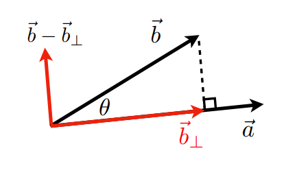
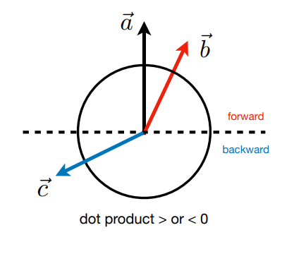
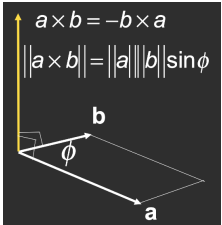
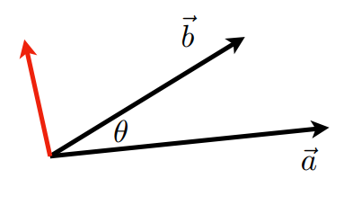
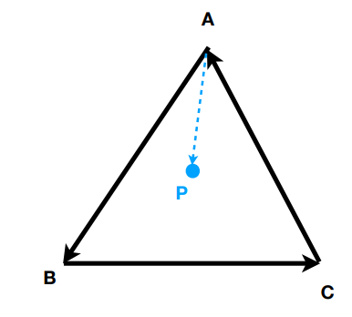

# 线性代数基础

## 向量

向量的乘积与一般数字的乘积有所不同，还需要考虑方向。总共分为点乘和叉乘，以下分别进行介绍

### 向量的点乘

向量点乘的基本公式为：$\vec{a} \cdot \vec{b} = \lVert \vec{a} \rVert \lVert \vec{b} \rVert \cos \theta$

对于上面这个公式我们最终算出来的结果是一个数，当然我们也可以进行一些简单的变换，仅知道两个向量便可知道两者的夹角：$\cos \theta = \frac{\vec{a} \cdot \vec{b}}{\lVert \vec{a} \rVert \lVert \vec{b} \rVert}$

对于单位向量有：$\cos \theta = \hat{a} \cdot \hat{b}$

#### 点乘的运算规则

向量的点乘满足一些基本的运算规则，如交换律，分配律，但是不满足__结合律__!，仅满足类似下面第三种这种类似结合律的形式。

- $\vec{a} \cdot \vec{b} =\vec{b} \cdot \vec{a}$
- $\vec{a} \cdot(\vec{b} + \vec{c}) = \vec{a} \cdot \vec{b} + \vec{a} \cdot \vec{c}$
- $(k \vec{a} ) \cdot \vec{b} = \vec{a} \cdot (k \vec{b}) =k(\vec{a} \cdot \vec{b})$

#### 笛卡尔坐标系中向量的点乘

在笛卡尔坐标系中若我们使用$(x_a,y_a)，(x_b,y_b)$分别表示两个向量$\vec{a}，\vec{b}$，那么他们两个的点乘计算便是对应的$x，y$分别相乘最后相加，例如
$$
\vec{a} \cdot \vec{b} = \begin{pmatrix}x_a \cr y_a \end{pmatrix} \cdot \begin{pmatrix} x_b \cr y_b \end{pmatrix} = x_a x_b + y_a y_b
$$

#### 投影

投影即是把一个向量分解到另一个向量上，我们可以通过向量的点乘计算来计算一个向量在另一个向量上的投影。具体计算可以理解为需要知道向量$\vec{b}$在向量$\vec{a}$上面投影的模的大小，之后乘上向量$\vec{a}$的单位向量。

我们使用$\vec{b}\_{\perp}$表示向量$\vec{b}$的投影
$$
\vec{b}_{\perp}=\lVert \vec{b} \rVert \cos \theta \thinspace \hat{a}
$$

- 如图我们知道投影之后可以将向量进行分解，分解成两个互相垂直的向量。

- 我们同时也可以计算判断两个向量的方向是否接近，对于单位向量若比较接近则两个向量点乘会接近1，若完全相反则为-1

### 向量的叉乘

向量叉乘的结果是另一个向量，这个向量与现有的向量都垂直，具体计算公式为：$\lVert \vec{a} \times \vec{b} \rVert = \lVert \vec{a} \rVert \lVert \vec{b} \rVert \sin \theta$ 。

叉乘不满足**交换律**，故仅有$\vec{a} \times \vec{b} = - \vec{b} \times \vec{a}$

#### 叉乘的运算规则

$\vec{x}\times\vec{y}=+\vec{z}$

$\vec{y}\times\vec{x}=-\vec{z}$

$\vec{y}\times\vec{z}=+\vec{x}$

$\vec{z}\times\vec{y}=-\vec{x}$

$\vec{z}\times\vec{x}=+\vec{y}$

$\vec{x}\times\vec{z}=-\vec{y}$

$\vec{a}\times\vec{b}=-\vec{b}\times\vec{a}$

$\vec{a}\times\vec{a}=\vec{0}$

$\vec{a}\times(\vec{b}+\vec{c})=\vec{a}\times\vec{b}+\vec{a}\times\vec{c}$

$\vec{a}\times(k\vec{b})=k(\vec{a}\times\vec{b})$

#### 笛卡尔坐标系中向量的叉乘

设： $\vec{a}=(a_x,a_y,a_z)$ $\vec{b}=(b_x,b_y,b_z)$ 

则叉乘结果为：
$$
\vec{a}\times\vec{b} = \begin{pmatrix} a_yb_z-a_zb_y \cr a_zb_x-a_xb_z \cr a_xb_y-a_yb_x \end{pmatrix}
$$
也可以写成行列式形式：
$$
\vec{a}\times\vec{b} = \begin{vmatrix} \vec{i}&\vec{j}&\vec{k} \cr a_x&a_y&a_z \cr b_x&b_y&b_z \end{vmatrix}
$$

展开： $\vec{a}\times\vec{b} = (a_yb_z-a_zb_y)\vec{i} + (a_zb_x-a_xb_z)\vec{j} + (a_xb_y-a_yb_x)\vec{k}$

#### 叉乘的作用

##### 判定左右

我们可以利用叉乘来判定两个向量的位置关系，例如我们想知道向量$\vec{b}$对于向量$\vec{a}$的关系，那么我们就将两个向量进行叉乘$\vec{a} \times \vec{b}$，若结果是正的那么向量$\vec{b}$就在向量$\vec{a}$左侧，若是负的则在右侧。

##### 判定内外

知道如何利用叉乘来判断左右之后我们可以进阶来判断某个点是否在一个多边形的内侧。例如有如下的图$A,B,C$三个点按照逆时针的顺序排列，我们现在想要知道$P$点是否在三点构成的三角形的内侧。接下来我们从$A$出发，新建$\vec{AP}$，将向量$\vec{AB}$与$\vec{AP}$作叉乘运算$\vec{AB}\times\vec{AP}$，$B,C$也如此。可以发现三者结果均为正，那么可以说明$P$在$ABC$内部，若是有一个不同则表明$P$在外部。若是$A,B,C$三点是顺时针排列的，那么叉乘结果均为负则可说明$P$在内部。此方法推广到多边形时，适用于凸多边形，不适用于凹多边形。

#### 正交归一坐标系（Orthonormal Coordinate Frames）

##### 定义

一个**正交归一坐标系**是在三维空间中的三个向量：

$\vec{u},\vec{v},\vec{w}$

并且满足以下条件：

##### 1. 单位长度（Unit Length）

每个向量的长度都为 1：

$\lVert\vec{u}\rVert=\lVert\vec{v}\rVert=\lVert\vec{w}\rVert=1$

##### 2. 两两正交（Orthogonality）

三个向量之间互相垂直：

$$
\vec{u}\cdot\vec{v}=\vec{v}\cdot\vec{w}=\vec{u}\cdot\vec{w}=0
$$

##### 3. 右手坐标系（Right-handed Coordinate System）

第三个坐标轴可以通过前两个坐标轴的叉乘得到：

$\vec{w}=\vec{u}\times\vec{v}$

这样形成一个**右手坐标系**。

##### 向量在正交归一基下的表示

任意三维向量 $\vec{p}$ 可以表示为：

$$
\vec{p}=(\vec{p}\cdot\vec{u})\vec{u}+(\vec{p}\cdot\vec{v})\vec{v}+(\vec{p}\cdot\vec{w})\vec{w}
$$

其中：

- $(\vec{p}\cdot\vec{u})\vec{u}$ 表示 $\vec{p}$ 在 $\vec{u}$ 方向上的投影
- $(\vec{p}\cdot\vec{v})\vec{v}$ 表示 $\vec{p}$ 在 $\vec{v}$ 方向上的投影
- $(\vec{p}\cdot\vec{w})\vec{w}$ 表示 $\vec{p}$ 在 $\vec{w}$ 方向上的投影

##### 核心思想

正交归一基提供了一个特殊的坐标系统：

- 坐标轴之间相互垂直
- 每个坐标轴长度为 1
- 可以通过点积直接得到向量在各个方向上的分量

## 矩阵

### 矩阵的乘法

想要实现矩阵的乘法首先要满足矩阵乘法的实现条件，即若矩阵$A,B$相乘，则$A$的列数必须与$B$的行数相等。

$(M\times N)(N\times P)=(M\times P)$

最后矩阵相乘的结果元素$(i,j)$是原矩阵$A$的第$i$行与矩阵$B$第$j$列作用的结果。

#### 矩阵乘法运算定律

矩阵乘法有结合律和分配律但没有__交换律__!

$(AB)C=A(BC)$

$A(B+C)=AB+AC$

$(A+B)C=AC+BC$

### 矩阵的转置

矩阵的转置就是把原来的元素$(i,j)$变为$(j,i)$，例如
$$
\begin{pmatrix} 1&2 \cr 3&4 \cr 5&6 \end{pmatrix}^{T}=\begin{pmatrix} 1&3&5 \cr 2&4&6 \end{pmatrix}
$$

矩阵转置还有以下性质
$$
(AB)^T=B^TA^T
$$

### 矩阵的逆

#### 单位矩阵

单位矩阵表示的是主对角线元素全为1，且其余位置全为0的矩阵

如
$$
I_{3\times 3} = \begin{pmatrix} 1&0&0\cr 0&1&0 \cr 0&0&1 \end{pmatrix}
$$

#### 逆矩阵

若互乘为单位矩阵则两矩阵互为逆矩阵。

$AA^{-1} = A^{-1} A = I$

对于逆矩阵有如下性质

$(AB)^{-1} = B^{-1} A^{-1}$

## 向量乘积的矩阵表示

### 点乘

$$
\vec{a}\cdot\vec{b}=\vec{a}^{T}\vec{b}= \begin{pmatrix} x_a&y_a&z_a \end{pmatrix} \begin{pmatrix} x_b \cr y_b \cr z_b \end{pmatrix} = (x_ax_b+y_ay_b+z_az_b)
$$

### 叉乘

$$
\vec{a}\times\vec{b}=A^*\vec{b}= \begin{pmatrix} 0&-z_a&y_a \cr z_a&0&-x_a \cr -y_a&x_a&0 \end{pmatrix} \begin{pmatrix} x_b \cr y_b \cr z_b \end{pmatrix}
$$

其中：
$$
A^*= \begin{pmatrix} 0&-z_a&y_a \cr z_a&0&-x_a \cr -y_a&x_a&0 \end{pmatrix}
$$
称为向量 $\vec{a}$ 的 **dual matrix（对偶矩阵）**。

